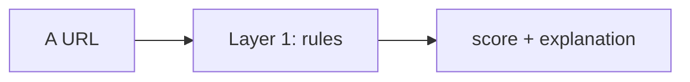
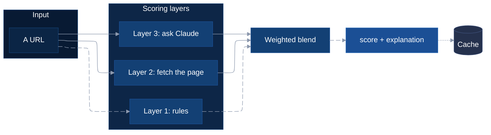

# Getting Started with AI Tools

**CS676 Algorithms for Data Science · Pace University**

For many of you this is the first time using a coding assistant like **Claude Code** or
**Codex**. That is expected, and it is worth a short guide, because the difference
between someone who gets a lot out of these tools and someone who gets very little is
almost never about how much they already knew. It is about how they ask.

This file is a set of habits, not rules. Read it once, try three or four of the
prompts, and come back to it when something isn't working.

---

## Table of Contents

- [First, the one that matters](#first-the-one-that-matters)
- [Prompts that change the answer you get](#prompts-that-change-the-answer-you-get)
  - [Calibrate the explanation to you](#calibrate-the-explanation-to-you)
  - [Ask whether it is even a good idea](#ask-whether-it-is-even-a-good-idea)
  - [Control the length](#control-the-length)
- [Prompts for Python and environments](#prompts-for-python-and-environments)
- [Prompts for understanding code you did not write](#prompts-for-understanding-code-you-did-not-write)
- [Markdown is the format these tools read best](#markdown-is-the-format-these-tools-read-best)
  - [Mermaid diagrams](#mermaid-diagrams)
  - [LaTeX math](#latex-math)
  - [Learning these without a tutorial](#learning-these-without-a-tutorial)
- [Using it as a tutor, not a ghostwriter](#using-it-as-a-tutor-not-a-ghostwriter)
- [A short checklist](#a-short-checklist)

---

## First, the one that matters

**Say what's actually in your head, then ask for the register you want.**

Most people write a stiff, formal question because it feels like the "right" way to
talk to a computer. You get a stiff, formal answer back — usually one pitched above
where you are, full of terms you'd have to look up.

Instead, ramble. Say the confused version. Then add one sentence at the end that tells
it how to answer you:

> I'm trying to figure out what this credibility scorer is doing, something about
> layers and blending, I don't really follow how the two parts combine or why there
> are two at all. **Is this feasible to understand in an afternoon? Can you explain it
> to me like I'm 18 years old?**

That last sentence does most of the work. You are naming your audience, and naming an
audience is the single most reliable way to change the level an explanation comes back
at. "Explain it like I'm 18" reliably produces something you can actually read;
"explain this to me" does not.

You are not being graded on how you phrase a prompt. Nobody sees it. Write badly and
finish the thought.

---

## Prompts that change the answer you get

### Calibrate the explanation to you

| Prompt | Use it when |
| --- | --- |
| `Can you explain this to me like I'm 18 years old?` | The first answer was over your head |
| `Can you give an analogy in 5 sentences?` | You want intuition before mechanics |
| `Explain this to someone who knows Python but has never used git.` | You want it pitched at your *actual* gaps |

Naming the gap is better than naming an age when you know the gap. "I know pandas but
I've never used a terminal" gets you a far better answer than "explain simply."

### Ask whether it is even a good idea

Add this to the end of almost anything:

> **Is this feasible?**

These tools will happily help you build the thing you asked for, even when the thing
you asked for is the hard way round. Asking whether it's feasible — or *"is there a
simpler approach?"*, or *"what would you do instead?"* — gets you the critique before
you've spent three hours. This is the prompt most students don't think to use, and the
one that saves the most time.

### Control the length

| Prompt | Effect |
| --- | --- |
| `Can you give a succinct answer?` | Cuts the preamble and the caveats |
| `Just the command, no explanation.` | For when you already understand and need the syntax |
| `Walk me through it step by step, I'll tell you when to move on.` | For when you want to actually learn it |

---

## Prompts for Python and environments

Environment setup is where most people lose their first afternoon. These tools are
genuinely good at it — it's exactly the kind of fiddly, well-documented work they
handle well.

> I want to build a Python project using **uv** to manage the environment. Can you do
> it for me?

> I'm getting `ModuleNotFoundError: No module named 'numpy'` and I don't understand
> why. Here's the full error: *(paste the whole thing, not a summary)*

> What is the difference between `pip install` and `uv sync`? Explain it like I'm 18.

**Paste the entire error message, including the traceback.** Summarising it ("it says
something about a module") throws away the part that identifies the problem. The
traceback is the most information-dense thing you will ever hand these tools.

This course uses `uv` throughout. If that is unfamiliar, there is a short script in the
homework folder that demonstrates it by running:

```bash
cd notebooks/homework
uv run 00_uv_tutorial.py
```

It isn't graded and has no blanks. It prints which Python is executing it, what got
installed, and what your command-line flags became.

---

## Prompts for understanding code you did not write

This is the skill the projects actually demand. You are handed a working repository and
asked to improve one part of it — which means first understanding the parts you are not
touching.

> Can you pull this GitHub URL — *(paste the URL)* — and explain to me what this repo
> is about? Make it simple.

> Read the folder. There's a Streamlit app inside. I want you to create a **mermaid
> diagram** to help me understand the system architecture.

> Read `credibility.py` and tell me what it does, where it's fragile, and which
> function I'd change first if I wanted to improve the score.

That middle one is worth trying even if you've never heard of mermaid. Asking for a
diagram forces a different kind of answer than asking for a description — it has to
commit to what the actual pieces are and how they connect, which is much harder to be
vague about.

---

## Markdown is the format these tools read best

A Markdown file is a plain text file ending in `.md`. That's it — you can open one in
any editor. It's the format this README is written in, and the format almost all
documentation uses.

It matters for two reasons. **These tools read it well**, because it's most of what
they were trained on, and **it's the easiest way to take notes that you can hand back
to them later.** A `notes.md` file in your project where you record what you tried,
what broke, and what you decided is both a study aid and something you can paste into a
prompt when you need help.

Two features are worth knowing because they make a plain text file do things you'd
otherwise need other software for.

### Mermaid diagrams

You write a description of a diagram in text, and it renders as an actual picture on
GitHub. No drawing tool needed. Here is the smallest useful one:

````markdown

````

That works, and if you only ever write that much you will still get value out of it.
But a diagram in a report should look like it was meant, so this course uses one
consistent style — described next.

#### The house style for this course

**Use this style for every diagram you put in a report or a README.** Six rules:

| | |
| --- | --- |
| **Layout** | ELK (`layout: elk`) — handles dense graphs far better than the default |
| **Fills** | Shades of dark blue, getting lighter as you move away from the entry point |
| **Fonts** | White |
| **Arrows** | Grey |
| **Main path** | Animated arrows |
| **Secondary links** | Plain, un-animated arrows |

The animation is the part that does real work: it separates *the path the data actually
takes* from *the supporting connections*, so a reader's eye follows the main flow
without you having to explain it in a caption.

#### A simple example

````markdown

````

Which renders as:


**How the pieces map to the rules.** The `config` block at the top selects ELK and sets
the grey arrow colour once, globally. Named edges (`e1@-->`) are the ones you animate,
declared afterwards with `e1@{ animate: true }`; ordinary `-->` and `-.->` edges stay
still. `classDef` defines the blue shades — `entry` darkest, then `layer`, then `output`
— and `class` applies them. Subgraph containers get their own darker fill through
`style`. Every fill sets `color:#ffffff` so text stays white.

**Copy that block and edit the node names.** You do not need to memorise any of it, and
you can hand it to Claude Code as a template: *"Use this exact mermaid style and redraw
it for the architecture in this folder."*

One caveat worth knowing: **ELK layout and edge animation are recent Mermaid features.**
Most renderers support them, but if you paste a diagram somewhere that doesn't, it falls
back to the default layout and static arrows — the colours and structure still render,
so nothing breaks badly. Check how yours looks wherever you are submitting it.

This is a genuinely good way to understand a codebase, and a genuinely good way to show
an architecture in a report.

### LaTeX math

Markdown also renders mathematical notation, which matters for this course because
every algorithm you write has a formula behind it. Inline math goes between single
dollar signs, and display math between double:

```markdown
The MSE is $L(\beta) = \frac{1}{n}\sum_i (y_i - x_i^\top \beta)^2$, and its gradient is

$$\frac{\partial L}{\partial \beta} = -\frac{2}{n} X^\top (y - X\beta)$$
```

Writing the formula next to your code is one of the better ways to check that your code
matches the formula.

### Learning these without a tutorial

You do not need to go find a course on either of these. Ask:

> What is a mermaid diagram in a Markdown file? Show me three small examples.

> What is LaTeX math in a Markdown file, and how do I write a summation and a fraction?

> How should I learn these? Give me a 20-minute path.

That pattern — *"what is X, show me examples, how do I learn it"* — works for almost any
tool you run into for the rest of this course.

---

## Using it as a tutor, not a ghostwriter

One thing worth being direct about. There are two ways to use these tools, and they
lead to very different places.

**The trap** is asking for finished code, pasting it in, and moving on. It works — right
up until the report asks you to justify your approach and you can't, because you didn't
make the choice. That is visible in a submission, and it costs you exactly the marks the
assignment is built around.

**What works better** is treating it as a tutor who is always available and never
impatient:

- **Explanation before implementation.** *"Explain how fetching a web page works in
  Python, and what can go wrong"* before *"write me a scraper."*
- **Bring your code, not a blank page.** Paste a function from the project and ask what
  it does and where it's fragile.
- **Make it argue.** *"Why that approach and not the alternatives? What are the
  tradeoffs?"* If the answer doesn't land, keep pushing.
- **Use it on errors, not just on code.** Paste the whole traceback and ask what it
  means. Reading errors is a skill, and this is the fastest way to build it.

**The test before you submit:** could you explain every piece of your code, out loud,
without notes? If not, you are not finished — not because it's against the rules, but
because the report will expose it.

---

## A short checklist

When you're stuck, in order:

1. **Paste the whole error**, traceback included. Don't summarise it.
2. **Say what you expected to happen** and what happened instead.
3. **Ask "is this feasible?"** before you ask "how do I do it?"
4. **Ask for it at your level** — *"explain it like I'm 18"*, or name your actual gap.
5. **Ask for a diagram** when you're trying to understand something with parts.
6. **Write down what you learned** in a `.md` file, so you can hand it back later.

And when something in this repository behaves in a way the documentation doesn't
describe, say so. Two of the bugs fixed this term were found by students who noticed
that two numbers which should have differed didn't — and asked instead of assuming they
were the problem.
