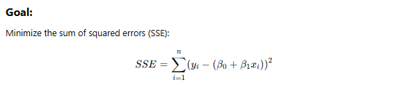

# Supervised Learning Overview

Back to [home](../README.md)

## 📚 What is Supervised Learning?
Supervised Learning is a type of machine learning approach that involves training a model on a labeled dataset. In this context, the dataset consists of features (`X`) and a corresponding response (`Y`). The goal is to learn a mapping from the input features to the output response so that the model can make predictions on new, unseen data.

- **Features (X)**: These are the input variables or predictors in the dataset.
- **Response (Y)**: This is the output variable or the target that the model is trying to predict.




## Solve for the Solutions


Here's the steps to derive closed form:


## Linear Regression Model
A linear regression model is a fundamental approach in statistics used to model the relationship between a dependent variable (`Y`) and one or more independent variables (`X`). The formula for a simple linear regression model with one predictor is:

```python
import numpy as np

# Simple linear regression model
def linear_regression(X, beta_0, beta_1):
    epsilon = np.random.normal(0, 1, len(X))  # Error term
    Y = beta_0 + beta_1 * X + epsilon
    return Y
```

Where:
- `Y` is the response variable.
- `X` is the predictor variable.
- `beta_0` is the y-intercept.
- `beta_1` is the slope of the line.
- `epsilon` is the error term generated with normal distribution.


## Least Square Loss Function
The least squares loss function is used to estimate the coefficients of the linear regression model. It calculates the sum of the squared differences between the observed responses in the dataset and the responses predicted by the linear approximation. The formula is:

```python
def least_square_loss(y, y_pred):
    loss = np.sum((y - y_pred) ** 2)
    return loss
```

Where:
- `loss` is the sum of squared differences.
- `y` is the actual response for the observations.
- `y_pred` is the predicted response for the observations.

## Main Assumptions of OLS Model
The Ordinary Least Squares (OLS) model relies on several key assumptions:
1. **Linearity**: The relationship between `X` and `Y` is linear.
2. **Independence**: The observations are independent of each other.
3. **Homoscedasticity**: The variance of the error terms is constant.
4. **Normality**: The error terms are normally distributed.

## Training the Model
There are two main approaches to training a linear regression model: likelihood maximization and gradient descent.

### Likelihood Maximization
This approach involves solving the model using the log-likelihood function, often implicit in optimization packages.

### Gradient Descent
Gradient descent is an optimization algorithm used to minimize the loss function. It iteratively adjusts the parameters to find the best values that minimize the cost function. The update rule in gradient descent is implemented as follows:

```python
def gradient_descent(X, y, alpha=0.01, iterations=1000):
    n = len(y)
    beta_0 = 0
    beta_1 = 0
    
    for _ in range(iterations):
        y_pred = beta_0 + beta_1 * X
        d_beta_0 = -(2/n) * np.sum(y - y_pred)
        d_beta_1 = -(2/n) * np.sum((y - y_pred) * X)
        
        beta_0 -= alpha * d_beta_0
        beta_1 -= alpha * d_beta_1
        
    return beta_0, beta_1
```

Where `alpha` is the learning rate.


## Solve for the Best Solution based on the Least Square Error
To find the best solution for the coefficients `beta_0` and `beta_1` in a linear regression model based on Ordinary Least Squares (OLS) assumptions, we minimize the least squares loss function. 

Let's denote:

- `mean_x = np.mean(X)` as the mean of `X`.
- `mean_y = np.mean(Y)` as the mean of `Y`.

Then, solving the system of equations, we obtain the formulas for `beta_1` and `beta_0`:

```python
def calculate_coefficients(X, Y):
    mean_x = np.mean(X)
    mean_y = np.mean(Y)
    
    beta_1 = np.sum((X - mean_x) * (Y - mean_y)) / np.sum((X - mean_x) ** 2)
    beta_0 = mean_y - beta_1 * mean_x
    
    return beta_0, beta_1
```

These equations give us the best linear unbiased estimators for `beta_0` and `beta_1` under the OLS assumptions. The slope `beta_1` tells us how much the response variable `Y` changes for a one-unit change in the predictor variable `X`, and the intercept `beta_0` gives the value of `Y` when `X` is zero.

## Example Using sklearn and Numpy

Here is a simple Python code snippet using `sklearn` and `numpy` to illustrate the linear regression model:

```python
import numpy as np
from sklearn.linear_model import LinearRegression
import matplotlib.pyplot as plt

# Generating synthetic data
np.random.seed(0)
X = 2 * np.random.rand(100, 1)
y = 4 + 3 * X + np.random.randn(100, 1)

# Training the model
model = LinearRegression()
model.fit(X, y)

# Making predictions
X_new = np.array([[0], [2]])
y_predict = model.predict(X_new)

# Plotting
plt.scatter(X, y)
plt.plot(X_new, y_predict, color='red')
plt.xlabel('X')
plt.ylabel('Y')
plt.title('Linear Regression Example')
plt.show()
```

This code generates a simple linear dataset and fits a linear regression model using `sklearn`. It also visualizes the fitted line. 

### Use Tensorflow Library

To replicate a linear regression model similar to `sklearn`'s `LinearRegression` using TensorFlow, you can create a simple neural network with no hidden layers and a single unit in the output layer. This setup mimics the behavior of a linear regression model. Below is a step-by-step guide and the corresponding code to achieve this:

#### Step 1: Import TensorFlow
First, import the TensorFlow library. If you haven't already installed TensorFlow, you can do so using `pip install tensorflow`.

```python
import tensorflow as tf
```

#### Step 2: Define the Model
Define a neural network model using TensorFlow's `Sequential` API. Since it's a linear regression, the model will have no hidden layers and just one unit in the output layer.

```python
model = tf.keras.Sequential([
    tf.keras.layers.Dense(1, input_shape=(X.shape[1],))
])
```

Here, `Dense(1)` creates a single unit (neuron) which is equivalent to the output of linear regression. `input_shape` is set to match the number of features in your input dataset `X`.

#### Step 3: Compile the Model
Compile the model with Stochastic Gradient Descent (SGD) as the optimizer and Mean Squared Error (MSE) as the loss function. These choices are typical for a linear regression model.

```python
model.compile(optimizer='sgd', loss='mean_squared_error')
```

#### Step 4: Train the Model
Train the model with your features `X` and labels `y`. You will need to specify the number of epochs, which determines how many times the model will iterate over the entire dataset.

```python
model.fit(X, y, epochs=number_of_epochs)
```

Replace `number_of_epochs` with the desired number of iterations (e.g., 100, 200, etc.)

#### Full Example Code

```python
import tensorflow as tf

# Assuming X and y are defined and preprocessed

# Define the model
model = tf.keras.Sequential([
    tf.keras.layers.Dense(1, input_shape=(X.shape[1],))
])

# Compile the model
model.compile(optimizer='sgd', loss='mean_squared_error')

# Train the model
model.fit(X, y, epochs=100)  # Replace 100 with your chosen number of epochs
```

This code will create and train a TensorFlow model that performs linear regression, analogous to using `LinearRegression` from `sklearn`. Ensure that your input data `X` and labels `y` are correctly preprocessed and available for training.

# What data is good for linear regression?

What data set do you think is good for linear regression model? We will revisit this again in the future.


The `make_blobs` function from `sklearn.datasets` is commonly used to generate synthetic datasets for clustering tasks. Below is a sample code that demonstrates how to create toy data using `make_blobs`.

```python
import matplotlib.pyplot as plt
from sklearn.datasets import make_blobs

# Generate toy data
n_samples = 300
n_features = 2
centers = 4
cluster_std = 1.0
random_state = 42

X, y = make_blobs(n_samples=n_samples,
                  n_features=n_features,
                  centers=centers,
                  cluster_std=cluster_std,
                  random_state=random_state)

# Plot the generated toy data
plt.figure(figsize=(8, 6))
plt.scatter(X[:, 0], X[:, 1], c=y, cmap='viridis', marker='o', edgecolor='k', s=50)
plt.title("Sample Blobs")
plt.xlabel("Feature 1")
plt.ylabel("Feature 2")
plt.grid(True)
plt.show()
```

### Explanation:

- **Parameters:**
  - `n_samples`: Total number of samples.
  - `n_features`: Number of features (dimensionality) for each sample.
  - `centers`: The number of centers (clusters) to generate.
  - `cluster_std`: The standard deviation of the clusters.
  - `random_state`: Determines random number generation for dataset creation. Use an integer to ensure reproducibility.

- **Output:**
  - `X`: An array of shape `(n_samples, n_features)` containing the feature values.
  - `y`: An array of shape `(n_samples,)` containing the cluster labels for each sample.

The plot at the end visualizes the generated data points and shows how they are distributed across different clusters. Feel free to adjust parameters like `n_samples`, `centers`, or `cluster_std` to observe how the output changes.

# Tensorflow Implementation on Colab

```python
# import
import os
import numpy as np
import pandas as pd
import matplotlib.pyplot as plt

# get data
train_path = '/content/sample_data/california_housing_train.csv'
test_path = '/content/sample_data/california_housing_test.csv'
train = pd.read_csv(train_path)
test = pd.read_csv(test_path)

# define X and y
X_train = train.iloc[:, train.columns!='median_house_value']
y_train = train['median_house_value']
X_test = test.iloc[:, test.columns!='median_house_value']
y_test = test['median_house_value']

# import
import tensorflow as tf

# define a neural network model
model = tf.keras.models.Sequential(name='this_model')
model.add(tf.keras.layers.Dense(1, input_shape=[8]))
model.summary()

# compile
model.compile(optimizer='rmsprop', loss='mae')

# fit
model.fit(X_train, y_train, validation_split=0.2, epochs=10)

# save
model.save('tmp_model_yin.h5')

# predict on test set
y_test_pred_ = model.predict(X_test)

# how accurate?
# step 1: take the difference
y_test_pred_.reshape((-1)) - np.asarray(y_test)

# step 2: take the absolute value of the difference
np.abs(y_test_pred_.reshape((-1)) - np.asarray(y_test))

# sttep 3: take the average of the absolute difference
np.mean(np.abs(y_test_pred_.reshape((-1)) - np.asarray(y_test)))
```