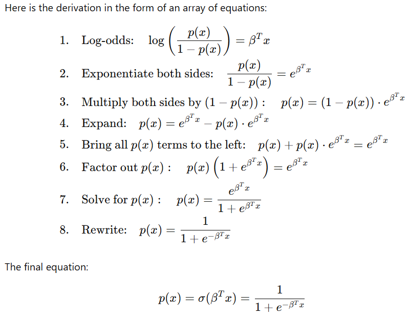
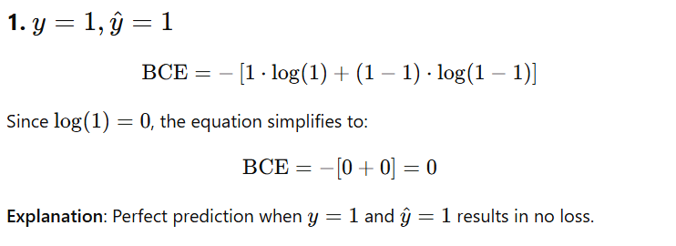
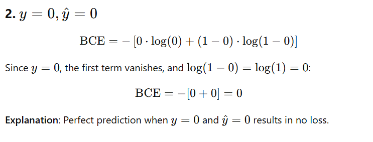
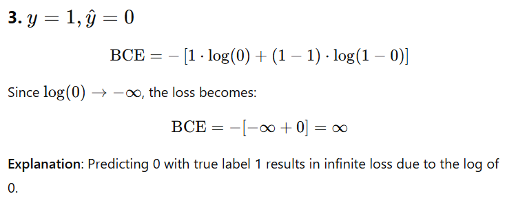
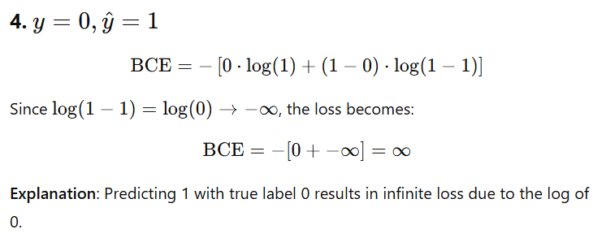

# Introduction to Classification and Logistic Regression

Back to [home](../README.md)

## 1. Motivational Example

Imagine you are developing a medical diagnostic tool to predict whether a patient has a particular disease ("Positive") or not ("Negative") based on blood test results. This is a classic **classification task**, where the outcome is one of a limited set of categories (Positive or Negative).


### Definitions
- **Categorical Variable**: A variable that represents discrete categories. In our example, the diagnosis is categorical with values `Positive` or `Negative`.
- **Continuous Variable**: A variable that takes any value within a range. For instance, a patient’s blood glucose level is continuous as it can take any real number within a valid range.

## 2. The Concept of a Classification Problem

A **classification problem** involves predicting a categorical variable (the class) based on one or more input variables. The goal is to assign a label to new, unseen data based on patterns learned from training data.

For example, in spam detection, we classify emails as "Spam" or "Not Spam" based on features such as subject line, sender, and email content.



## 3. Probability Framework and Sigmoid Function

In classification problems, we often estimate the probability of an input belonging to each category. For binary classification, we focus on estimating the probability of the positive class (e.g., "Disease Positive").

The **Sigmoid Function** is commonly used in binary classification tasks to map any real-valued input to a probability between 0 and 1.

```python
import numpy as np

def sigmoid(z):
    return 1 / (1 + np.exp(-z))

# Example usage:
z = 1.5  # This might be a weighted sum of input features
prob = sigmoid(z)
print(f"The predicted probability of the positive class is: {prob:.4f}")
```


## 4. Solving Classification with Maximum Likelihood

When we say we solve a problem using **maximum likelihood**, we mean finding the parameters (e.g., weights in logistic regression) that maximize the likelihood of the observed data. Essentially, we find the parameters that make the observed outcomes most probable.

- For classification, this involves predicting probabilities and comparing them to the actual outcomes in the data.
- The likelihood increases when the predicted probabilities match the actual labels closely.

## 5. Relationship Between Maximum Likelihood and Log-Loss (Cross-Entropy)

In practice, we minimize the **negative log-likelihood** instead of maximizing the likelihood because it’s computationally simpler. This is known as the **log-loss function** or **cross-entropy loss**.


### Edge Cases









| Case                  | y   | ŷ      | BCE       |
|--|--|--|--|
| Perfect Positive      | 1   | 1      | 0         |
| Perfect Negative      | 0   | 0      | 0         |
| Wrong (Should Be 1)   | 1   | 0      | ∞         |
| Wrong (Should Be 0)   | 0   | 1      | ∞         |

The average log-loss across all data points measures how well the model’s predicted probabilities align with the true labels.

## 6. Logistic Regression Model

### What is Logistic Regression?
**Logistic Regression** is a classification algorithm that models the probability of the positive class as a function of input features. It uses the sigmoid function to ensure the output is a probability.

```python
from sklearn.linear_model import LogisticRegression
from sklearn.datasets import make_classification

# Generate synthetic data
X, y = make_classification(n_samples=100, n_features=2, n_classes=2, random_state=42)

# Train a logistic regression model
model = LogisticRegression()
model.fit(X, y)

# Predict probabilities for the positive class
probs = model.predict_proba(X)[:, 1]
print("Predicted probabilities:", probs[:5])
```

### Loss Function
The loss function for logistic regression is the **log-loss function**, which is minimized during training. It ensures that the predicted probabilities are as close as possible to the true labels.

We will use the following toy data:

```python
import numpy as np

# Toy data: true labels and predicted probabilities
y_true = np.array([1, 0, 1, 0])
y_pred = np.array([0.9, 0.1, 0.8, 0.2])
```

We can use *tensorflow*:

```python
import tensorflow as tf
import numpy as np

# Toy data
y_true = np.array([1, 0, 1, 0], dtype=np.float32)
y_pred = np.array([0.9, 0.1, 0.8, 0.2], dtype=np.float32)

# Compute log-loss using TensorFlow
bce = tf.keras.losses.BinaryCrossentropy()
loss = bce(y_true, y_pred)

print(f"TensorFlow Log-Loss: {loss.numpy()}")
```

We can also use *torch*:

```python
import torch
import torch.nn as nn

# Toy data
y_true = torch.tensor([1, 0, 1, 0], dtype=torch.float32)
y_pred = torch.tensor([0.9, 0.1, 0.8, 0.2], dtype=torch.float32)

# Compute log-loss using PyTorch
bce = nn.BCELoss()
loss = bce(y_pred, y_true)

print(f"PyTorch Log-Loss: {loss.item()}")
```

## 7. Making Inference Using Logistic Regression

To make predictions with a trained logistic regression model:
1. Compute the probability of the positive class using the sigmoid function.
2. Assign a label based on a threshold (typically 0.5 for binary classification).

```python
# Example inference
sample = [[0.5, 1.2]]  # A new sample with 2 features
prob = model.predict_proba(sample)[0, 1]  # Probability of positive class
label = model.predict(sample)[0]  # Predicted label

print(f"Predicted probability: {prob:.4f}")
print(f"Predicted label: {label}")
```

### Summary
- Logistic regression is a simple yet powerful algorithm for binary classification tasks.
- It predicts probabilities using the sigmoid function.
- The model is trained by minimizing the log-loss function, which is equivalent to maximizing the likelihood of the observed data.
- Inference involves computing probabilities and assigning labels based on a threshold.

By understanding these concepts, you’ll have a solid foundation for tackling more advanced classification techniques!

## 8. Classification from Scratch

In this section, we will implement a binary classification model from scratch using **TensorFlow** and **PyTorch**. The goal is to understand how components like the sigmoid activation function, binary cross-entropy loss, and gradient descent fit together in logistic regression.

### TensorFlow Implementation

#### Sigmoid Activation Function

```python
import tensorflow as tf

def sigmoid(x):
    """Sigmoid activation function."""
    return 1 / (1 + tf.exp(-x))
```

#### Linear Regression

```python
def linear_regression(X, W, b):
    """
    Computes the linear combination of inputs and weights.
    
    Parameters:
    X: tf.Tensor - Input features
    W: tf.Tensor - Weights
    b: tf.Tensor - Bias
    
    Returns:
    tf.Tensor - Linear combination
    """
    return tf.linalg.matvec(X, W) + b
```

#### Logistic Regression

```python
def logistic_regression(X, W, b):
    """
    Logistic regression model: Applies sigmoid activation on linear regression output.
    
    Parameters:
    X: tf.Tensor - Input features
    W: tf.Tensor - Weights
    b: tf.Tensor - Bias
    
    Returns:
    tf.Tensor - Predicted probabilities
    """
    z = linear_regression(X, W, b)
    return sigmoid(z)
```

#### Binary Cross-Entropy Loss

```python
def calc_bce_loss(y, y_hat):
    """
    Computes binary cross-entropy loss.
    
    Parameters:
    y: tf.Tensor - True labels
    y_hat: tf.Tensor - Predicted probabilities
    
    Returns:
    tf.Tensor - Loss value
    """
    epsilon = 1e-7  # Prevent log(0)
    y_hat = tf.clip_by_value(y_hat, epsilon, 1 - epsilon)
    return -tf.reduce_mean(y * tf.math.log(y_hat) + (1 - y) * tf.math.log(1 - y_hat))
```

#### Gradient Descent

```python
def gradient_descent(X, y, W, b, lr):
    """
    Updates model parameters using gradient descent.
    
    Parameters:
    X: tf.Tensor - Input features
    y: tf.Tensor - True labels
    W: tf.Variable - Weights
    b: tf.Variable - Bias
    lr: float - Learning rate
    
    Returns:
    tf.Variable, tf.Variable - Updated weights and bias
    """
    with tf.GradientTape() as tape:
        y_hat = logistic_regression(X, W, b)
        loss = calc_bce_loss(y, y_hat)
    
    gradients = tape.gradient(loss, [W, b])
    W.assign_sub(lr * gradients[0])
    b.assign_sub(lr * gradients[1])
    return W, b
```

#### Predict Function

```python
def predict(X, W, b, threshold=0.5):
    """
    Makes predictions based on logistic regression.
    
    Parameters:
    X: tf.Tensor - Input features
    W: tf.Tensor - Weights
    b: tf.Tensor - Bias
    threshold: float - Threshold for classification
    
    Returns:
    tf.Tensor - Predicted classes (0 or 1)
    """
    y_hat = logistic_regression(X, W, b)
    return tf.cast(y_hat >= threshold, dtype=tf.int32)
```

#### Test

```python
import tensorflow as tf

# Toy dataset
X = tf.constant([[1.0, 2.0], [2.0, 3.0], [3.0, 4.0], [4.0, 5.0]], dtype=tf.float32)  # Input features
y = tf.constant([0.0, 0.0, 1.0, 1.0], dtype=tf.float32)  # True labels

# Initialize parameters
W = tf.Variable([0.1, -0.1], dtype=tf.float32)  # Weights
b = tf.Variable(0.0, dtype=tf.float32)  # Bias
lr = 0.1  # Learning rate

# Number of iterations
num_iterations = 1000

# Step-by-step test
print("Initial Weights:", W.numpy())
print("Initial Bias:", b.numpy())

for i in range(num_iterations):
    W, b = gradient_descent(X, y, W, b, lr)

    if i % 100 == 0:  # Print progress every 100 iterations
        y_hat = logistic_regression(X, W, b)
        loss = calc_bce_loss(y, y_hat)
        print(f"Iteration {i}, Loss: {loss.numpy()}")

# Final parameters
print("Final Weights:", W.numpy())
print("Final Bias:", b.numpy())

# Predictions
predictions = predict(X, W, b, threshold=0.5)
print("Predictions:", predictions.numpy())

# Check final probabilities
probabilities = logistic_regression(X, W, b)
print("Predicted Probabilities:", probabilities.numpy())
```

### PyTorch Implementation

#### Sigmoid Activation Function

```python
import torch
import torch.nn.functional as F

def sigmoid(x):
    """Sigmoid activation function."""
    return 1 / (1 + torch.exp(-x))
```

#### Linear Regression

```python
def linear_regression(X, W, b):
    """
    Computes the linear combination of inputs and weights.
    
    Parameters:
    X: torch.Tensor - Input features
    W: torch.Tensor - Weights
    b: torch.Tensor - Bias
    
    Returns:
    torch.Tensor - Linear combination
    """
    return X @ W + b
```

#### Logistic Regression

```python
def logistic_regression(X, W, b):
    """
    Logistic regression model: Applies sigmoid activation on linear regression output.
    
    Parameters:
    X: torch.Tensor - Input features
    W: torch.Tensor - Weights
    b: torch.Tensor - Bias
    
    Returns:
    torch.Tensor - Predicted probabilities
    """
    z = linear_regression(X, W, b)
    return sigmoid(z)
```

#### Binary Cross-Entropy Loss

```python
def calc_bce_loss(y, y_hat):
    """
    Computes binary cross-entropy loss.
    
    Parameters:
    y: torch.Tensor - True labels
    y_hat: torch.Tensor - Predicted probabilities
    
    Returns:
    torch.Tensor - Loss value
    """
    epsilon = 1e-7  # Prevent log(0)
    y_hat = torch.clamp(y_hat, epsilon, 1 - epsilon)
    return -torch.mean(y * torch.log(y_hat) + (1 - y) * torch.log(1 - y_hat))
```

#### Gradient Descent

```python
def gradient_descent(X, y, W, b, lr):
    """
    Updates model parameters using gradient descent.
    
    Parameters:
    X: torch.Tensor - Input features
    y: torch.Tensor - True labels
    W: torch.Tensor - Weights
    b: torch.Tensor - Bias
    lr: float - Learning rate
    
    Returns:
    torch.Tensor, torch.Tensor - Updated weights and bias
    """
    y_hat = logistic_regression(X, W, b)
    loss = calc_bce_loss(y, y_hat)
    
    loss.backward()  # Compute gradients
    
    with torch.no_grad():
        W -= lr * W.grad
        b -= lr * b.grad
        
        # Zero gradients for the next step
        W.grad.zero_()
        b.grad.zero_()
    
    return W, b
```

#### Predict Function

```python
def predict(X, W, b, threshold=0.5):
    """
    Makes predictions based on logistic regression.
    
    Parameters:
    X: torch.Tensor - Input features
    W: torch.Tensor - Weights
    b: torch.Tensor - Bias
    threshold: float - Threshold for classification
    
    Returns:
    torch.Tensor - Predicted classes (0 or 1)
    """
    y_hat = logistic_regression(X, W, b)
    return (y_hat >= threshold).int()
```

#### Test

```python
import torch

# Toy dataset
X = torch.tensor([[1.0, 2.0], [2.0, 3.0], [3.0, 4.0], [4.0, 5.0]], dtype=torch.float32)  # Input features
y = torch.tensor([0.0, 0.0, 1.0, 1.0], dtype=torch.float32)  # True labels

# Initialize parameters
W = torch.tensor([0.1, -0.1], dtype=torch.float32, requires_grad=True)  # Weights
b = torch.tensor(0.0, dtype=torch.float32, requires_grad=True)  # Bias
lr = 0.1  # Learning rate

# Number of iterations
num_iterations = 1000

# Test training process
print("Initial Weights:", W.detach().numpy())
print("Initial Bias:", b.detach().numpy())

for i in range(num_iterations):
    # Perform gradient descent
    W, b = gradient_descent(X, y, W, b, lr)

    if i % 100 == 0:  # Print progress every 100 iterations
        y_hat = logistic_regression(X, W, b)
        loss = calc_bce_loss(y, y_hat)
        print(f"Iteration {i}, Loss: {loss.item()}")

# Final parameters
print("Final Weights:", W.detach().numpy())
print("Final Bias:", b.detach().numpy())

# Predictions
predictions = predict(X, W, b, threshold=0.5)
print("Predictions:", predictions.numpy())

# Check final probabilities
probabilities = logistic_regression(X, W, b)
print("Predicted Probabilities:", probabilities.detach().numpy())
```

### Conclusion

This implementation demonstrates how to build a binary classification model from scratch using **TensorFlow** and **PyTorch**. Each helper function is modular, allowing for easy debugging and understanding of how logistic regression works internally. By implementing these steps, you gain a deeper understanding of the mechanics behind binary classification. 