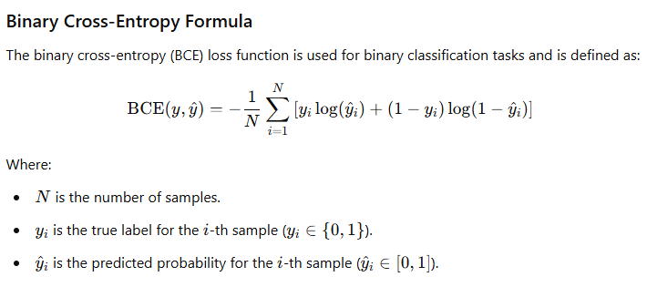

# Introduction to Classification and Logistic Regression

Back to [home](../README.md)

## 1. Motivational Example

Imagine you are developing a medical diagnostic tool to predict whether a patient has a particular disease ("Positive") or not ("Negative") based on blood test results. This is a classic **classification task**, where the outcome is one of a limited set of categories (Positive or Negative).


### Definitions
- **Categorical Variable**: A variable that represents discrete categories. In our example, the diagnosis is categorical with values `Positive` or `Negative`.
- **Continuous Variable**: A variable that takes any value within a range. For instance, a patient’s blood glucose level is continuous as it can take any real number within a valid range.

## 2. The Concept of a Classification Problem

A **classification problem** involves predicting a categorical variable (the class) based on one or more input variables. The goal is to assign a label to new, unseen data based on patterns learned from training data.

For example, in spam detection, we classify emails as "Spam" or "Not Spam" based on features such as subject line, sender, and email content.


## 3. Probability Framework and Sigmoid Function

In classification problems, we often estimate the probability of an input belonging to each category. For binary classification, we focus on estimating the probability of the positive class (e.g., "Disease Positive").

The **Sigmoid Function** is commonly used in binary classification tasks to map any real-valued input to a probability between 0 and 1.

```python
import numpy as np

def sigmoid(z):
    return 1 / (1 + np.exp(-z))

# Example usage:
z = 1.5  # This might be a weighted sum of input features
prob = sigmoid(z)
print(f"The predicted probability of the positive class is: {prob:.4f}")
```


## 4. Solving Classification with Maximum Likelihood

When we say we solve a problem using **maximum likelihood**, we mean finding the parameters (e.g., weights in logistic regression) that maximize the likelihood of the observed data. Essentially, we find the parameters that make the observed outcomes most probable.

- For classification, this involves predicting probabilities and comparing them to the actual outcomes in the data.
- The likelihood increases when the predicted probabilities match the actual labels closely.

## 5. Relationship Between Maximum Likelihood and Log-Loss (Cross-Entropy)

In practice, we minimize the **negative log-likelihood** instead of maximizing the likelihood because it’s computationally simpler. This is known as the **log-loss function** or **cross-entropy loss**.



### Edge Cases


| Case                  | y   | ŷ (ŷ) | BCE       |
|-----------------------|-----|--------|-----------|
| Perfect Positive      | 1   | 1      | 0         |
| Perfect Negative      | 0   | 0      | 0         |
| Wrong (Should Be 1)   | 1   | 0      | ∞         |
| Wrong (Should Be 0)   | 0   | 1      | ∞         |

The average log-loss across all data points measures how well the model’s predicted probabilities align with the true labels.

## 6. Logistic Regression Model

### What is Logistic Regression?
**Logistic Regression** is a classification algorithm that models the probability of the positive class as a function of input features. It uses the sigmoid function to ensure the output is a probability.

```python
from sklearn.linear_model import LogisticRegression
from sklearn.datasets import make_classification

# Generate synthetic data
X, y = make_classification(n_samples=100, n_features=2, n_classes=2, random_state=42)

# Train a logistic regression model
model = LogisticRegression()
model.fit(X, y)

# Predict probabilities for the positive class
probs = model.predict_proba(X)[:, 1]
print("Predicted probabilities:", probs[:5])
```

### Loss Function
The loss function for logistic regression is the **log-loss function**, which is minimized during training. It ensures that the predicted probabilities are as close as possible to the true labels.

## 7. Making Inference Using Logistic Regression

To make predictions with a trained logistic regression model:
1. Compute the probability of the positive class using the sigmoid function.
2. Assign a label based on a threshold (typically 0.5 for binary classification).

```python
# Example inference
sample = [[0.5, 1.2]]  # A new sample with 2 features
prob = model.predict_proba(sample)[0, 1]  # Probability of positive class
label = model.predict(sample)[0]  # Predicted label

print(f"Predicted probability: {prob:.4f}")
print(f"Predicted label: {label}")
```

### Summary
- Logistic regression is a simple yet powerful algorithm for binary classification tasks.
- It predicts probabilities using the sigmoid function.
- The model is trained by minimizing the log-loss function, which is equivalent to maximizing the likelihood of the observed data.
- Inference involves computing probabilities and assigning labels based on a threshold.

By understanding these concepts, you’ll have a solid foundation for tackling more advanced classification techniques!

