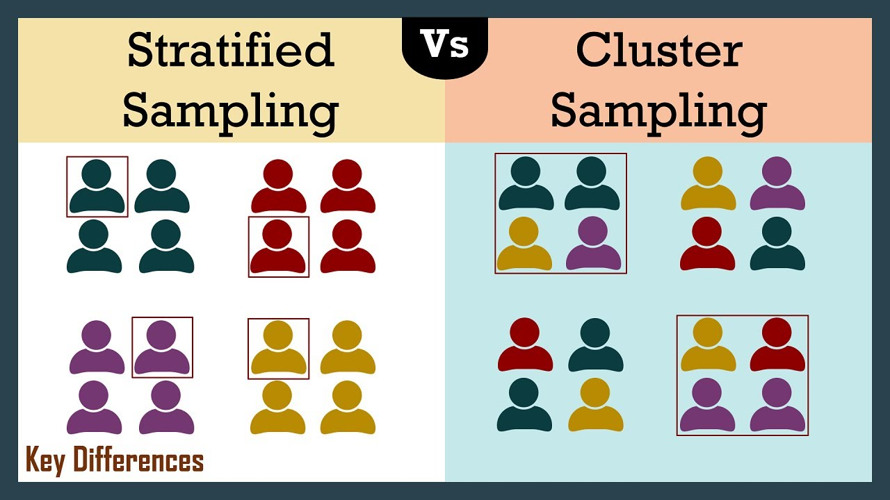
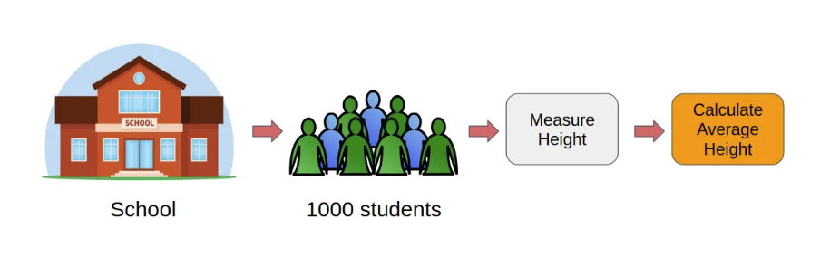
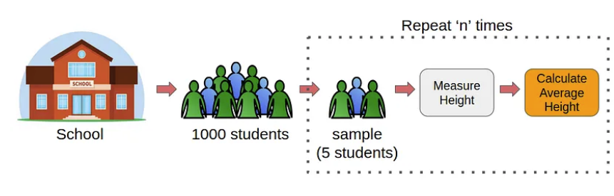
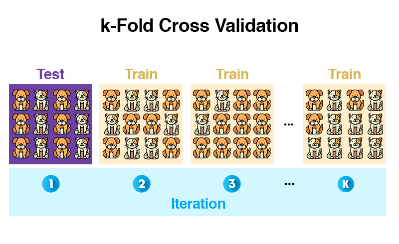
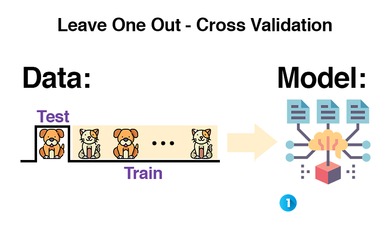

# Lecture Notes: Sampling, Bootstrap, and Cross Validation

Back to [home](https://github.com/yiqiao-yin/pace-u-cs676)

## What is Sampling?

**Sampling** refers to the process of selecting a subset of data from a larger dataset. The goal is to make inferences about the entire dataset using the selected subset.

### Types of Sampling:
1. **Random Sampling**: Each data point has an equal chance of being selected.
2. **Stratified Sampling**: Ensures proportional representation of subgroups within the dataset.
3. **Systematic Sampling**: Selects data points at regular intervals from the dataset.

### Why Sampling?
- Reduces computational cost.
- Enables analysis when the full dataset is unavailable.
- Helps in testing hypotheses without processing all data.



## What is Bootstrap?

**Bootstrap** is a statistical technique that involves:
1. Randomly sampling from the data with replacement.
2. Generating multiple datasets (called bootstrap samples).
3. Calculating statistics (e.g., mean, variance) for each sample to estimate uncertainty.




### Why Use Bootstrap?
- It estimates the variability of a statistic without requiring additional data.
- Useful for small datasets where traditional sampling may fail.

**Python Example:**
```python
import numpy as np

# Original dataset
data = [5, 10, 15, 20, 25]

# Generate bootstrap samples
bootstrap_sample = np.random.choice(data, size=len(data), replace=True)
print("Bootstrap Sample:", bootstrap_sample)
```

---

## Why are Sampling and Bootstrap Helpful for Machine Learning?

### Motivation:
1. **Model Generalization**: Understand how well a model performs on unseen data.
2. **Variance Estimation**: Assess the stability of model predictions.
3. **Robustness**: Improve model reliability by accounting for data variability.

Sampling and bootstrap allow us to:
- Train models on subsets to prevent overfitting.
- Measure model performance under different scenarios.

---

## What is Cross Validation?

**Cross Validation (CV)** is a method to evaluate the performance of a model by splitting the data into training and validation sets multiple times.

### Why Do We Need Cross Validation?
- Prevents overfitting.
- Provides a more reliable estimate of model performance.
- Helps in hyperparameter tuning.

### Common Cross Validation Techniques:
1. **K-Fold Cross Validation**:
   - Split the dataset into `k` subsets (folds).
   - Train the model on `k-1` folds and validate on the remaining fold.
   - Repeat for all folds and average the results.



2. **Leave-One-Out Cross Validation (LOOCV)**:
   - Use one sample as the validation set and the rest as training data.



## Which Resampling Method Should You Use?

This is the question that matters in practice, and it has a short answer and a long one.

The short answer: **first decide what you are trying to estimate.**

| You want to know… | Use | Because |
| --- | --- | --- |
| How uncertain is this *statistic*? (a median, a correlation, a difference between groups) | **Bootstrap** | It builds a sampling distribution for the quantity you computed, with no formula required |
| How well will this *model* predict unseen data? | **Cross validation** | It repeatedly hides data from the model and scores the predictions on what was hidden |
| Is this effect distinguishable from chance? | **Permutation test** | It destroys the relationship by shuffling labels, then asks how unusual your real result looks |

These are not interchangeable. Bootstrapping a model's training accuracy does not tell
you how it generalises, and cross-validating a median makes no sense. Picking the wrong
family is a more serious error than picking the wrong variant within a family.

### Choosing a cross-validation splitter

Once you know you want cross validation, the splitter follows from **one question: what
makes two rows in your data non-independent?** Plain k-fold assumes every row is
independent of every other. When that is false and you ignore it, the model sees
something in training that it will not see in production, and your score is too good.

| Situation | Splitter | What goes wrong without it |
| --- | --- | --- |
| Rows are independent; regression | `KFold` | — the default is correct |
| Classification, especially rare classes | `StratifiedKFold` | A fold can contain zero positives, so the metric is undefined or wildly noisy |
| Several rows per subject / patient / user / device | `GroupKFold` | The model memorises the subject from one row and recognises them in validation |
| Grouped *and* imbalanced | `StratifiedGroupKFold` | Both of the above at once |
| Ordered in time | `TimeSeriesSplit` | The model trains on the future to predict the past |
| Small dataset, need a stable estimate | `RepeatedKFold` | A single split is a coin flip; repeats average that away |
| You want explicit control of the train/test proportion | `ShuffleSplit` | — |

Scikit-learn's own guidance is blunt about the stakes: *"if we know that the generative
process has a group structure (samples collected from different subjects, experiments,
measurement devices), it is safer to use group-wise cross-validation."*

### How many folds?

Use **5 or 10**. The scikit-learn documentation states the consensus plainly: *"most
authors and empirical evidence suggest that 5 or 10-fold cross validation should be
preferred to LOO."*

Leave-one-out sounds like it should be the most thorough option, and it is the most
expensive — it fits `n` models instead of `k`. But each of its `n` estimates is computed
on a single data point, and those estimates are highly correlated with one another
because the training sets differ by only one row. The result is a **high-variance**
estimate of test error. Reach for LOOCV when the dataset is genuinely tiny and you
cannot afford to hold out five folds' worth of rows.

### Stratification: the failure is not subtle

With a rare class, plain k-fold can hand you a validation fold containing **none** of it:

```python
import numpy as np
from sklearn.model_selection import KFold, StratifiedKFold

rng = np.random.default_rng(0)
y = np.zeros(120, dtype=int)
y[:6] = 1                        # 5% positive class
rng.shuffle(y)
X = rng.normal(size=(120, 4))

for name, cv in [("KFold", KFold(5, shuffle=True, random_state=0)),
                 ("StratifiedKFold", StratifiedKFold(5, shuffle=True, random_state=0))]:
    per_fold = [int(y[test].sum()) for _, test in cv.split(X, y)]
    print(f"{name:16} positives per validation fold: {per_fold}")
```

```
KFold            positives per validation fold: [2, 0, 3, 1, 0]
StratifiedKFold  positives per validation fold: [1, 1, 1, 1, 2]
```

Two of the five folds have no positive cases at all. Recall is undefined there, ROC-AUC
cannot be computed, and whatever your script reports is an average over folds that were
not measuring the same thing. `StratifiedKFold` keeps the class ratio in every fold, and
for classification it should be your default rather than your fallback.

### Grouped data: where leakage actually hurts

Suppose each subject contributes ten rows, and one feature is effectively a fingerprint
for that subject — a device calibration constant, a baseline measurement, a store ID.
Split the rows at random and the model can identify the subject in validation because it
saw them in training:

```python
import numpy as np
from sklearn.model_selection import KFold, GroupKFold, cross_val_score
from sklearn.ensemble import RandomForestRegressor

rng = np.random.default_rng(676)
n_subjects, per_subject = 30, 10
groups = np.repeat(np.arange(n_subjects), per_subject)
n = len(groups)

fingerprint = rng.normal(scale=3.0, size=n_subjects)[groups]   # constant within a subject
signal = rng.normal(size=n)
subject_effect = rng.normal(scale=6.0, size=n_subjects)[groups]

X = np.column_stack([fingerprint, signal])
y = subject_effect + 0.5 * signal + rng.normal(scale=0.4, size=n)

model = RandomForestRegressor(n_estimators=120, random_state=0)
naive = cross_val_score(model, X, y, cv=KFold(5, shuffle=True, random_state=0), scoring="r2")
honest = cross_val_score(model, X, y, cv=GroupKFold(5), groups=groups, scoring="r2")

print(f"KFold      (subject appears on both sides): R2 = {naive.mean():.3f}")
print(f"GroupKFold (subject in exactly one fold)  : R2 = {honest.mean():.3f}")
```

```
KFold      (subject appears on both sides): R2 = 0.984
GroupKFold (subject in exactly one fold)  : R2 = -0.845
```

The same model and the same data report **R² of 0.98 and −0.85** depending only on how
the rows were split. The first number is not a better result; it is a different question.
It answers "can the model recognise a subject it has already seen?", and the honest
number answers "can it predict for a subject it has never seen?" — which is the thing you
will actually deploy.

### Time series: shuffling invents skill that does not exist

This one is worth seeing because the inflated number can be spectacular. Below, the
target is a random walk and the only feature is the timestamp. **There is no signal to
learn** — tomorrow's value is yesterday's plus noise:

```python
import numpy as np
from sklearn.model_selection import KFold, TimeSeriesSplit, cross_val_score
from sklearn.ensemble import RandomForestRegressor

rng = np.random.default_rng(676)
n = 500
y = np.cumsum(rng.normal(size=n))      # random walk: no predictable structure
y = y - y.mean()
X = np.arange(n).reshape(-1, 1).astype(float)   # the only feature is the timestamp

model = RandomForestRegressor(n_estimators=120, random_state=0)
shuffled = cross_val_score(model, X, y, cv=KFold(5, shuffle=True, random_state=0), scoring="r2")
forward = cross_val_score(model, X, y, cv=TimeSeriesSplit(5), scoring="r2")

print(f"KFold shuffled  (interpolates between known days): R2 = {shuffled.mean():.3f}")
print(f"TimeSeriesSplit (must extrapolate forward)       : R2 = {forward.mean():.3f}")
```

```
KFold shuffled  (interpolates between known days): R2 = 0.995
TimeSeriesSplit (must extrapolate forward)       : R2 = -5.477
```

Shuffled cross validation reports **99.5% of variance explained on data containing no
signal whatsoever.** It achieves this by interpolation: to predict day 50 it has already
seen days 49 and 51, so it only has to average two neighbours. `TimeSeriesSplit` always
trains on the past and validates on the future, and correctly reports that the model is
worse than predicting the mean.

If your rows have timestamps, this is not an edge case to consider later. Random
splitting on temporal data is one of the most common ways a project reports a result it
cannot reproduce in production.

### Nested cross validation: when you also tune

If you use cross validation to *choose* hyperparameters and then report that same
cross-validated score as your performance estimate, the number is optimistic. The folds
helped pick the configuration, so they are no longer held out from it.

Nested cross validation puts the tuning **inside** each outer fold. The clearest way to
see the effect is on data where the right answer is known in advance — pure noise, where
no model can beat 50%:

```python
import numpy as np
from sklearn.model_selection import GridSearchCV, StratifiedKFold, cross_val_score
from sklearn.pipeline import make_pipeline
from sklearn.preprocessing import StandardScaler
from sklearn.svm import SVC

rng = np.random.default_rng(676)
X = rng.normal(size=(80, 300))          # features carry no information about y
y = rng.integers(0, 2, size=80)         # so the honest accuracy of any model is 0.50

grid = {"svc__C": [0.01, 0.1, 1, 10, 100], "svc__gamma": [1e-4, 1e-3, 1e-2, 1e-1]}
pipe = make_pipeline(StandardScaler(), SVC())

search = GridSearchCV(pipe, grid, cv=StratifiedKFold(5, shuffle=True, random_state=0))
search.fit(X, y)

nested = cross_val_score(search, X, y, cv=StratifiedKFold(5, shuffle=True, random_state=1))

print(f"truth (no signal)             : 0.5000")
print(f"best tuned inner-CV score     : {search.best_score_:.4f}")
print(f"nested cross-validation score : {nested.mean():.4f}")
```

```
truth (no signal)             : 0.5000
best tuned inner-CV score     : 0.5625
nested cross-validation score : 0.5375
```

Searching twenty configurations on noise found one that scored **56%** — not because it
learned anything, but because with twenty tries something gets lucky. Nested CV pulls
the estimate back toward the truth.

Note that it does not reach exactly 0.50 either, and that is worth absorbing: with 80
rows, the estimate itself is noisy. Nested cross validation removes a *bias*; it does
not remove variance. The honest conclusion from this experiment is "no detectable
signal", not "53.75% accuracy".

### Bootstrap, done properly

The bootstrap example earlier in these notes draws one resample, which shows the
mechanism but not the point. The point is the **interval**. Draw thousands of resamples,
compute your statistic on each, and read the percentiles of the resulting distribution:

```python
import numpy as np

rng = np.random.default_rng(676)
sample = rng.lognormal(mean=1.0, sigma=0.8, size=60)   # skewed — normal theory is shaky here

B = 10_000
stats = np.empty(B)
for b in range(B):
    resample = rng.choice(sample, size=len(sample), replace=True)   # same size, with replacement
    stats[b] = np.median(resample)

lo, hi = np.percentile(stats, [2.5, 97.5])
print(f"observed median    : {np.median(sample):.3f}")
print(f"95% percentile CI  : [{lo:.3f}, {hi:.3f}]")
print(f"bootstrap std error: {stats.std(ddof=1):.3f}")
```

```
observed median    : 3.271
95% percentile CI  : [2.330, 3.730]
bootstrap std error: 0.428
```

Two details that are easy to get wrong. The resample must be the **same size** as the
original and drawn **with replacement** — that is what makes it a bootstrap rather than a
subsample. And this works for the median, for which there is no convenient closed-form
standard error. That is precisely when the bootstrap earns its keep.

SciPy will do it for you, including better interval methods than raw percentiles:

```python
import numpy as np
from scipy.stats import bootstrap

rng = np.random.default_rng(676)
sample = rng.lognormal(mean=1.0, sigma=0.8, size=60)

res = bootstrap((sample,), np.median, confidence_level=0.95,
                n_resamples=10_000, method="BCa", rng=rng)

print(f"95% BCa interval   : [{res.confidence_interval.low:.3f}, {res.confidence_interval.high:.3f}]")
print(f"bootstrap std error: {res.standard_error:.3f}")
```

`method="BCa"` is the default and adjusts for skew and bias in the bootstrap
distribution; `"percentile"` reproduces the hand-rolled version above.

How much that correction changes things depends on the statistic, not on how skewed the
raw data looks. On this same sample:

| Statistic | `percentile` | `BCa` |
| --- | --- | --- |
| median | `[2.330, 3.730]` | `[2.330, 3.735]` |
| mean | `[2.920, 4.018]` | `[2.934, 4.033]` |
| std | `[1.778, 2.492]` | `[1.858, 2.569]` |

For the median the two essentially agree; for the standard deviation the lower bound
moves by about 4%. The adjustment matters when the *bootstrap distribution* of your
statistic is itself skewed or biased, which is common for spread and scale estimates
and mild for central ones. Use the default, and do not assume the choice is cosmetic
without checking on your own statistic.

**Where the bootstrap breaks down.** It is not universal. It struggles badly with
statistics that depend on the extremes of the data — a maximum or a minimum, where
resampling can never produce a value larger than the one you already observed. It also
assumes your rows are independent, so bootstrapping dependent data (time series, repeated
measures) needs a block bootstrap rather than the plain version. The same question that
chooses your CV splitter — *what makes two rows non-independent?* — applies here.

### A decision checklist

When you are unsure, work down this list:

1. **Am I estimating uncertainty in a statistic, or predictive error in a model?** The
   answer picks bootstrap or cross validation.
2. **What makes two of my rows non-independent?** Subjects, time, geography, repeated
   measures. That answer picks the splitter.
3. **Is my target imbalanced?** If yes, stratify.
4. **Am I tuning anything on these folds?** If yes, nest — or hold out a final test set
   that the tuning never touches.
5. **Would I be comfortable showing this split to someone who wanted to prove the score
   wrong?** This is the useful version of all the questions above.

And report the spread, not just the mean. A cross-validated accuracy of 0.84 across folds
of `[0.83, 0.85, 0.84, 0.84, 0.84]` and one across `[0.71, 0.95, 0.80, 0.91, 0.83]` are
very different results, and the mean alone hides that completely.

### How to Perform Cross Validation Using Packages:

#### Using Scikit-Learn:
```python
from sklearn.model_selection import KFold, cross_val_score
from sklearn.linear_model import LinearRegression
from sklearn.datasets import make_regression

# Generate a synthetic dataset
X, y = make_regression(n_samples=100, n_features=1, noise=0.1)

# Initialize model
model = LinearRegression()

# Perform K-Fold Cross Validation
kf = KFold(n_splits=5)
scores = cross_val_score(model, X, y, cv=kf)
print("Cross Validation Scores:", scores)
print("Mean Score:", scores.mean())
```

#### Using TensorFlow:
```python
import tensorflow as tf
from sklearn.model_selection import KFold
import numpy as np

# Generate a synthetic dataset
X = np.random.rand(100, 1)
y = 3 * X[:, 0] + np.random.randn(100) * 0.1

# Define a simple model
def build_model():
    model = tf.keras.Sequential([
        tf.keras.layers.Dense(1, input_shape=(1,))
    ])
    model.compile(optimizer='adam', loss='mse')
    return model

# Perform K-Fold Cross Validation
kf = KFold(n_splits=5)
scores = []

for train_index, val_index in kf.split(X):
    model = build_model()
    model.fit(X[train_index], y[train_index], epochs=10, verbose=0)
    score = model.evaluate(X[val_index], y[val_index], verbose=0)
    scores.append(score)

print("Cross Validation Losses:", scores)
print("Mean Loss:", np.mean(scores))
```

---

### Cross Validation From Scratch:
```python
import numpy as np
from sklearn.linear_model import LinearRegression
from sklearn.metrics import mean_squared_error

# Generate synthetic data
np.random.seed(42)
X = np.random.rand(100, 1)
y = 3 * X[:, 0] + np.random.randn(100) * 0.1

# Number of folds
k = 5
fold_size = len(X) // k

mse_scores = []

for i in range(k):
    # Split data into training and validation sets
    val_start = i * fold_size
    val_end = val_start + fold_size

    X_val = X[val_start:val_end]
    y_val = y[val_start:val_end]

    X_train = np.concatenate([X[:val_start], X[val_end:]], axis=0)
    y_train = np.concatenate([y[:val_start], y[val_end:]], axis=0)

    # Train model
    model = LinearRegression()
    model.fit(X_train, y_train)

    # Validate model
    y_pred = model.predict(X_val)
    mse = mean_squared_error(y_val, y_pred)
    mse_scores.append(mse)

print("Cross Validation MSEs:", mse_scores)
print("Mean MSE:", np.mean(mse_scores))
```

---

## Measuring Variance and Error in Cross Validation

### Variance:
Variance reflects how much the model’s predictions vary across different validation sets. This can be calculated as the standard deviation of the scores.

**Python Example:**
```python
import numpy as np

scores = [0.85, 0.88, 0.84, 0.87, 0.86]
variance = np.var(scores)
print("Variance:", variance)
```

### Error:
Error represents the average difference between the predicted values and the actual values.

**Python Example:**
```python
from sklearn.metrics import mean_squared_error

y_true = [1.5, 2.0, 1.8]
y_pred = [1.4, 2.1, 1.7]
error = mean_squared_error(y_true, y_pred)
print("Mean Squared Error:", error)
```

## Homework

**[`03_cv.py`](https://github.com/yiqiao-yin/pace-u-cs676/blob/main/notebooks/homework/03_cv.py) — K-Fold Cross Validation from scratch**

Build the folds, then write the rotation loop that trains on k-1 of them and validates on the one left out. The script contrasts your cross-validated error against the resubstitution error, which comes out *below* the noise floor — an impossible result that shows exactly what fitting and scoring on the same rows measures.

The script is complete apart from the parts you write, and it grades itself, so you
are not guessing whether you got it right. Only numpy is needed. See the
[homework README](https://github.com/yiqiao-yin/pace-u-cs676/blob/main/notebooks/homework/README.md) for setup and the full list of exercises.
