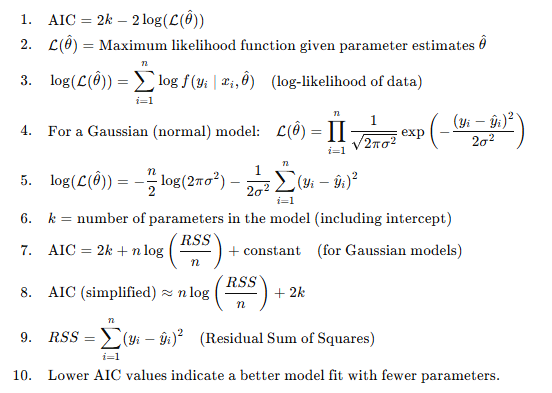
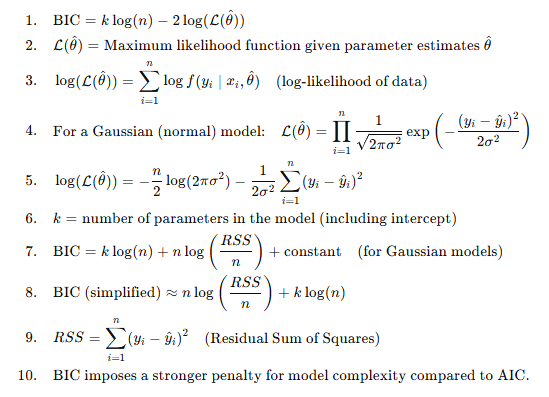
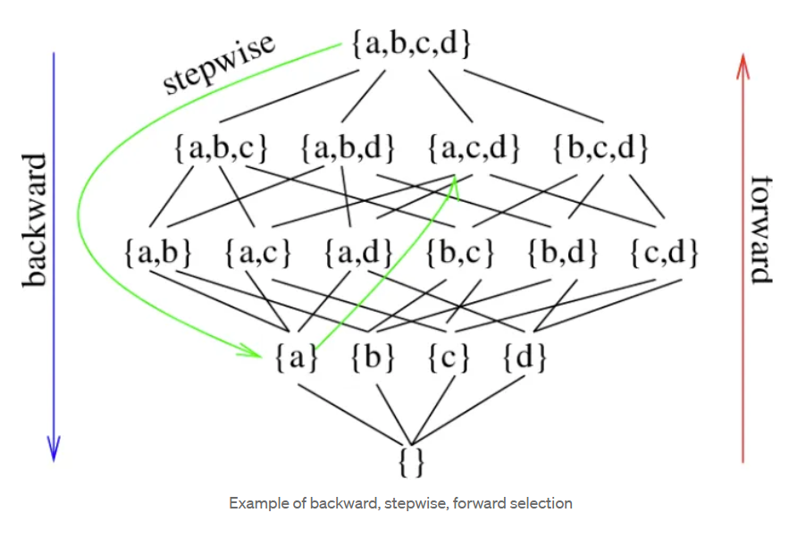
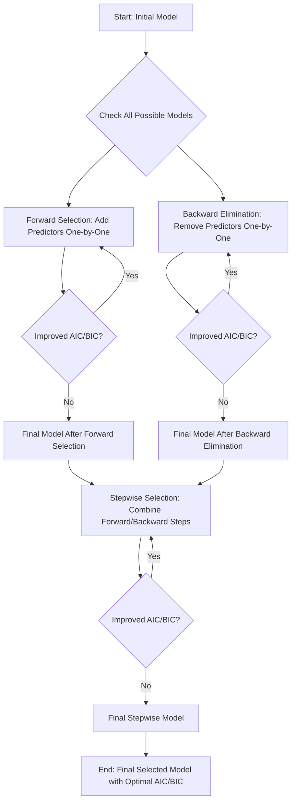
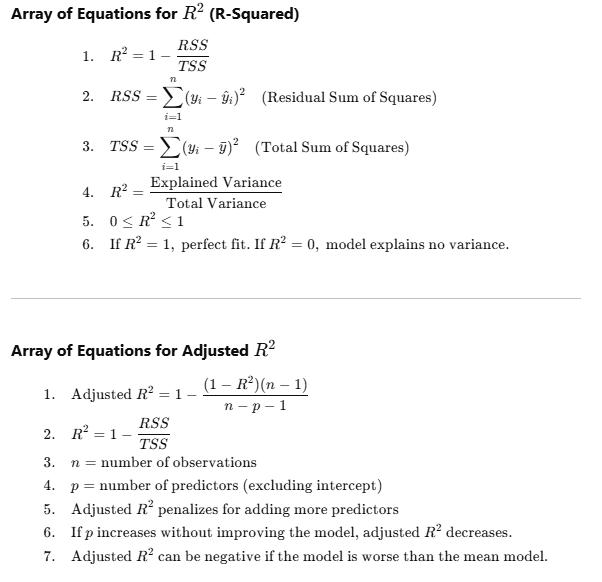
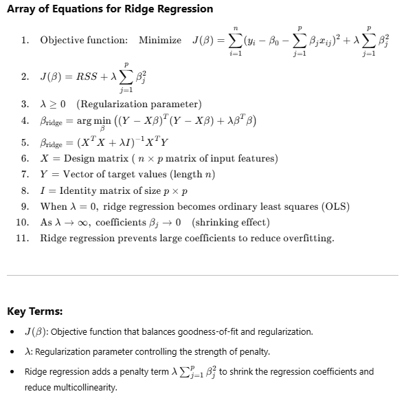
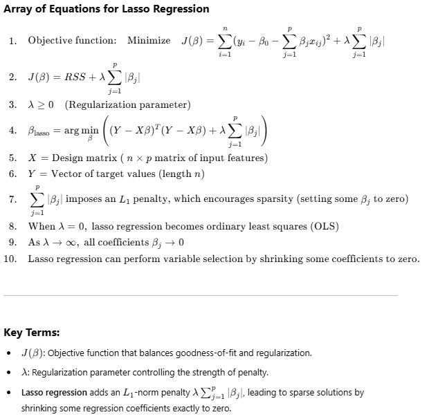
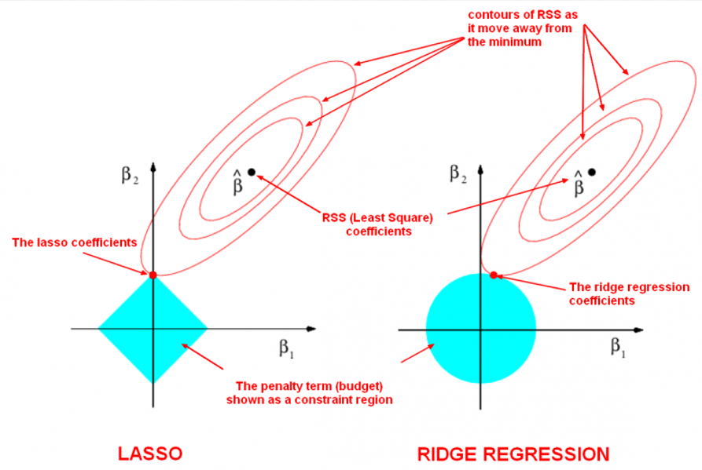
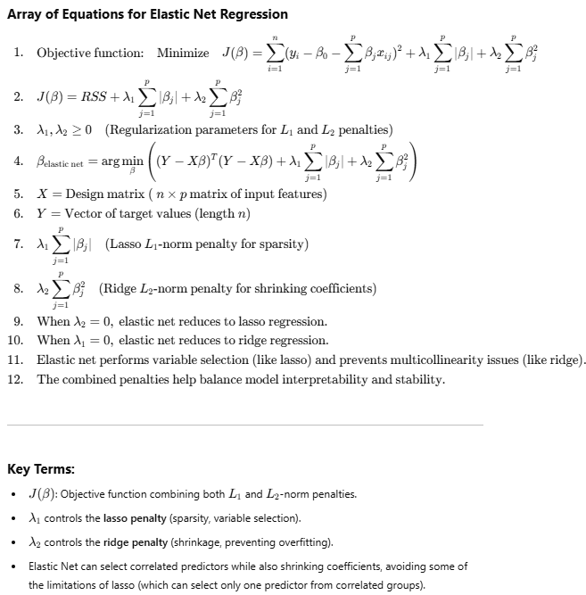

# Lecture Notes: Model Selection and Related Concepts

Back to [home](../README.md)

## 1. What is Model Selection? Why is it Important?
Model selection refers to the process of choosing the best statistical model from a set of candidate models. It is crucial for:

- **Predictive Performance**: Ensures accurate predictions on unseen data.
- **Interpretability**: Identifies important predictors, making results actionable.
- **Overfitting Avoidance**: Balances complexity and performance to prevent overfitting or underfitting.
- **Resource Efficiency**: Reduces computational costs and improves scalability.
- **Generalization**: Ensures the model performs well on new, unseen data.

## 2. What is $p \choose 2$?
When we have $p$ features and want to choose 2, $p \choose 2$ represents the number of unique pairs of features that can be formed. For example, with 10 features, there are 45 possible pairs. This combinatorial complexity increases rapidly as $p$ grows, impacting computational feasibility when analyzing interactions or selecting features in high-dimensional datasets.

## 3. Subset Selection and Error Measurement
### How to Measure Errors:
- **Residual Sum of Squares (RSS)**: Measures the total discrepancy between observed and predicted values. Lower RSS indicates a better fit.
- **Akaike Information Criterion (AIC)**: Balances goodness-of-fit with model complexity. Lower AIC values indicate better models.
- **Bayesian Information Criterion (BIC)**: Similar to AIC but imposes a stronger penalty for complexity, favoring simpler models.

### Key Differences:
- **AIC**: Optimizes prediction accuracy, tolerating slightly more complexity.
- **BIC**: More conservative, leading to simpler models.
- **RSS**: A raw error measure, unsuitable for comparing models with differing complexities.

### How to interpret **AIC**?



### How to interpret **BIC**?



## 4. What is Forward Stepwise Selection?
Forward stepwise selection starts with no predictors and adds the most significant predictor iteratively until no further improvement is observed.



### Procedure

- **Forward Selection**: Starts with an empty model and adds predictors one-by-one based on improving AIC/BIC.
- **Backward Elimination**: Starts with the full model and removes predictors one-by-one.
- **Stepwise Selection**: Combines forward and backward steps iteratively.
- The process stops when no further improvement in AIC/BIC is observed.

This flowchart visualizes the step-by-step process of model selection using **AIC/BIC** criteria.



### Advantages:
- Simplifies modeling for large datasets.
- Computationally efficient compared to testing all subsets.

### Disadvantages:
- May miss optimal predictor combinations.

### Python Example:
```python
from sklearn.feature_selection import SequentialFeatureSelector
from sklearn.linear_model import LinearRegression

X, y = ... # Replace with data
model = LinearRegression()
forward_selector = SequentialFeatureSelector(model, direction='forward', n_features_to_select=5)
forward_selector.fit(X, y)
print("Selected features:", forward_selector.get_support())
```

## 5. What is Backward Stepwise Selection?
Backward stepwise selection starts with all predictors and removes the least significant one iteratively until further removal reduces performance.

### Advantages:
- Considers all predictors initially, reducing missed significant predictors.

### Disadvantages:
- Computationally intensive for large datasets.

### Python Example:
```python
backward_selector = SequentialFeatureSelector(model, direction='backward', n_features_to_select=5)
backward_selector.fit(X, y)
print("Selected features:", backward_selector.get_support())
```

## 6. Cp Statistic
**Cp** evaluates models by penalizing RSS with a term proportional to the number of predictors. It balances fit quality and model complexity, discouraging overfitting.


## 7. Adjusted $R^2$
- **Definition**: Adjusted $R^2$ accounts for the number of predictors, increasing only if new predictors improve the model beyond chance levels.
- **Comparison with $R^2$**:
  - $R^2$: Measures explained variance but always increases with added predictors.
  - Adjusted $R^2$: Penalizes unnecessary predictors, ensuring reliable model comparison.



**Key Differences:**
- **$R^2$** always increases when adding more predictors, even if they do not improve the model.
- **Adjusted $R^2$** adjusts for the number of predictors and only increases if the added predictors improve the model.

## 8. Ridge and Lasso Regression
- **Ridge Regression**:
  - Adds an L2 penalty to coefficients, shrinking them but retaining all predictors.
  - Ideal for multicollinearity.



- **Lasso Regression**:
  - Adds an L1 penalty, encouraging sparsity by shrinking some coefficients to zero.
  - Suitable for feature selection.



### Comparison between Ridge and Lasso

#### Ridge Regression (L2 Regularization)
- **Penalty Term**: It adds a penalty based on the square of the coefficient values to the loss function.
- **Effect on Coefficients**: Tends to shrink the coefficients towards zero, but typically does not make them exactly zero.
- **Feature Selection**: Does not perform feature selection; retains all features in the model with non-zero coefficients.
- **Use Case**: Ideal when you have many small or medium-sized effects or multicollinearity (highly correlated predictors).

#### Lasso Regression (L1 Regularization)
- **Penalty Term**: It adds a penalty based on the absolute value of the coefficient values to the loss function.
- **Effect on Coefficients**: Can shrink some coefficients to be exactly zero, effectively eliminating them from the model.
- **Feature Selection**: Automatically selects relevant variables by excluding those with zero coefficients, resulting in simpler models.
- **Use Case**: Useful when you expect only a few variables to be significant predictors or want a more interpretable model.

#### Common Points
- **Regularization Parameter**: Both methods introduce a parameter that controls the strength of the penalty. A higher value means more regularization, which affects both methods differently.
- **Bias-Variance Trade-off**: Both techniques add bias to reduce variance, aiming to improve the model's ability to generalize to unseen data.

Choosing between Ridge and Lasso depends on your dataset and problem specifics, like the need for feature selection or handling multicollinearity.



### Python Example:
```python
from sklearn.linear_model import Ridge, Lasso

ridge = Ridge(alpha=1.0)
ridge.fit(X, y)
print("Ridge coefficients:", ridge.coef_)

lasso = Lasso(alpha=0.1)
lasso.fit(X, y)
print("Lasso coefficients:", lasso.coef_)
```

## 9. What is ElasticNet?
ElasticNet combines Ridge and Lasso penalties, balancing coefficient stability and sparsity. It is useful for correlated predictors.


### Python Example:
```python
from sklearn.linear_model import ElasticNet

elastic_net = ElasticNet(alpha=0.1, l1_ratio=0.5)
elastic_net.fit(X, y)
print("ElasticNet coefficients:", elastic_net.coef_)
```

### Technical Discussion of ElasticNet Regression




### Summary
Model selection and regularization techniques like Ridge, Lasso, and ElasticNet enable interpretable and predictive models. Forward and backward stepwise selection streamline feature selection, while metrics like AIC, BIC, Cp, and adjusted $R^2$ guide model evaluation effectively.

