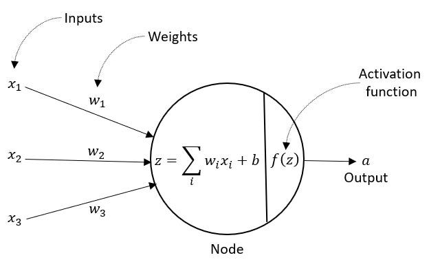
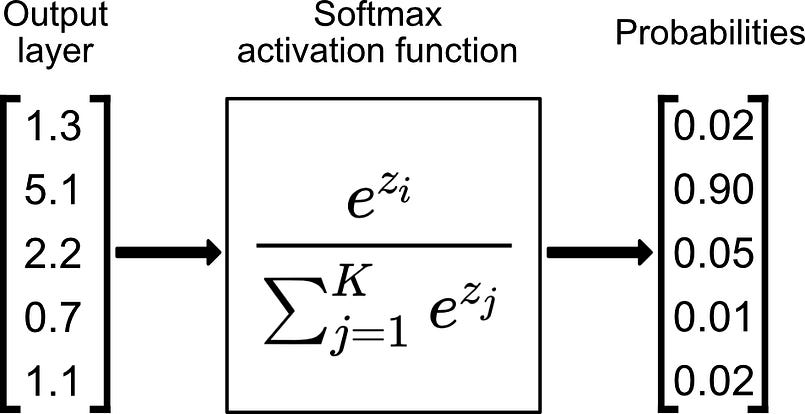
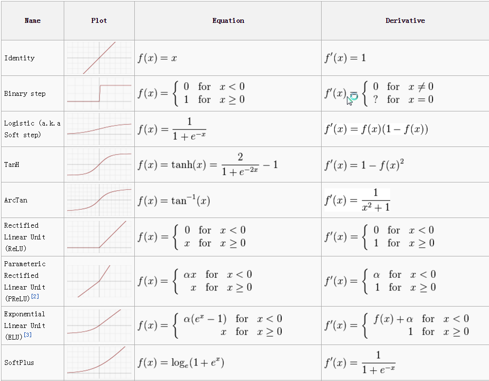
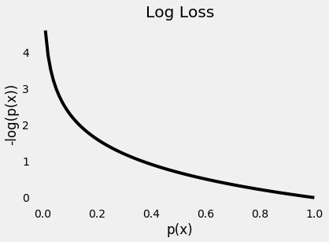
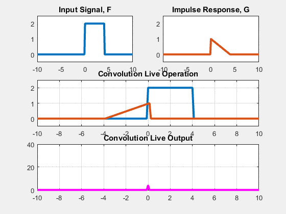

# Deep Learning

Back to [home](../README.md)

Deep learning is a subset of machine learning that attempts to model complex patterns in data using neural networks with multiple layers. It has revolutionized various fields by improving the performance of many tasks, such as image and speech recognition, natural language processing, and more.


## Fundamentals of Deep Learning

### Forward Propagation



Forward propagation is the process of passing inputs through the network to receive an output. This involves computing linear combinations of inputs and weights, applying activation functions, and eventually producing a prediction or classification. The primary goal during forward propagation is to predict outputs as close as possible to the actual values.

#### Process:

1. **Input Layer**: Accepts input features.
2. **Hidden Layers**: Each neuron performs two operations:
   - Computes a weighted sum of its inputs.
   - Applies a non-linear activation function.
3. **Output Layer**: Produces the final output of the network.

#### Probabilistic Output (Multi-class Classification)



#### List of Activation Functions



### Backward Propagation

Backward propagation, or backpropagation, is the process of updating the weights in the network based on the error of the output. It involves calculating the gradient of the loss function with respect to each weight by the chain rule, propagating these gradients backward through the network.

#### Steps:

1. **Calculate Loss**: Use a loss function to measure the deviation between predicted and actual output.
2. **Compute Gradients**: Determine the sensitivity of the loss function concerning the network's weights.
3. **Update Weights**: Adjust weights to minimize the error using optimization algorithms like gradient descent.

### Activation Function

Activation functions introduce non-linearity to the network and determine whether a neuron should be activated or not. They enable neural networks to capture complex patterns. Common activation functions include:

- **Sigmoid**: Maps input values to an output in the range (0, 1), often used in binary classification.
  $$
  \sigma(x) = \frac{1}{1 + e^{-x}}
  $$

- **ReLU (Rectified Linear Unit)**: Introduces sparsity and addresses vanishing gradient problems.
  $$
  f(x) = \max(0, x)
  $$

- **Tanh**: Outputs values between (-1, 1), used widely in multilayer networks.
  $$
  \tanh(x) = \frac{e^x - e^{-x}}{e^x + e^{-x}}
  $$

### Loss Function

The loss function quantifies how well the model's predictions match the actual outcomes. The choice of loss function influences how the model learns. Popular loss functions include:

- **Mean Squared Error (MSE)**: Used in regression models. Measures the average squared difference between predicted and actual values.
- **Cross-Entropy Loss**: Used for classification problems. Assesses the discrepancy between the predicted probability distribution and the true distribution.



Consider the following scenarios (you can assume $\hat{y}$ is the probability from $p(x)$):
- If predicted probabilities $\hat{y}_i$ is small (close to 0) and truth $y_i = 0$, what happens?
- If predicted probabilities $\hat{y}_i$ is small (close to 0) and truth $y_i = 1$, what happens?
- If predicted probabilities $\hat{y}_i$ is large (close to 1) and truth $y_i = 0$, what happens?
- If predicted probabilities $\hat{y}_i$ is large (close to 1) and truth $y_i = 1$, what happens?

Answers:
- If prediction $\hat{y}_i = 0.001$ and $y_i = 0$, then the loss is $-(1-0)\log(1-0.001)=-\log(0.999) \approx 0$, i.e. error is small so the model is good
- If prediction $\hat{y}_i = 0.001$ and $y_i = 1$, then the loss is $-\log(0.001)=-\log(0.001) = 3$, i.e. the error is large so the model is bad
- If prediction $\hat{y}_i = 0.999$ and $y_i = 0$, then the loss is $-(1-0)\log(1-0.999)=-\log(0.001)=3$, i.e. the error is large so the model is bad
- If prediction $\hat{y}_i = 0.999$ and $y_i = 1$, then the loss is $-\log(0.999) \approx 0$, i.e. error is small so the model is good

## Neural Networks and Architectures

Neural networks are structured as layers of interconnected nodes, where each node mimics biological neurons. Various architectures are engineered to address different types of data and problems.

### Feedforward Neural Networks (FNN)

Feedforward networks are the simplest type of artificial neural networks. In FNNs, information moves in one direction—from input nodes through any hidden nodes to output nodes. There are no cycles or loops in the network.

### Convolutional Neural Networks (CNN)

CNNs are specifically designed for processing grid-like data, such as images. They leverage spatial hierarchies by using convolutional layers to detect edges, textures, patterns, and ultimately, the complete object.

#### Convolutional Operation



#### Key Components:

- **Convolutional Layers**: Apply filters to create feature maps.


- **Pooling Layers**: Downsample feature maps through operations like max pooling or average pooling.


- **Fully Connected Layers**: Integrate features to classify input data into categories.

### Recurrent Neural Networks (RNN)

RNNs are architected to handle sequential data, making them suitable for language models and time series forecasting. They have memory cells that capture information about past computations.

#### Variants:

- **Long Short-Term Memory (LSTM)**: Addresses RNNs' vanishing gradient issues with mechanisms for storing long-term dependencies.
  
- **Gated Recurrent Units (GRU)**: Simplifies LSTMs while maintaining efficacy in capturing sequence dependencies.

## Applications in Real-World Problems

Deep learning has been transformative across industries, from enhancing user experiences to enabling new technologies.

### Image and Video Processing

- **Image Classification**: CNNs are widely used by companies like Google and Facebook for recognizing objects in images.
- **Object Detection**: Advanced applications like autonomous vehicles rely on CNNs for real-time environment perception and decision-making.
- **Facial Recognition**: Employed in security systems and social media platforms for identifying individuals.

### Natural Language Processing (NLP)

- **Machine Translation**: RNNs and transformers power translation services, such as Google Translate, by understanding context and grammar.
- **Sentiment Analysis**: Companies use NLP to interpret customer feedback, enabling better service responses and product improvements.
- **Chatbots and Virtual Assistants**: Tools like Siri and Alexa depend on sophisticated NLP models for interpreting and responding to human queries.

### Healthcare

- **Disease Prediction and Diagnostics**: Deep learning aids in analyzing medical imaging to detect diseases, providing early diagnosis and intervention strategies.
- **Personalized Medicine**: Models process genomic data to tailor treatments specific to individual genetic profiles.

### Autonomous Vehicles

- **Navigation Systems**: Self-driving cars utilize deep learning for path planning, obstacle detection, and traffic sign recognition, significantly contributing to transportation safety and efficiency.

In summary, deep learning's ability to automatically extract intricate features from raw data makes it an indispensable tool in modern AI applications. With continued advancements in computational power and data availability, deep learning will likely push the boundaries of what's currently achievable in AI.

# Neural Networks from Scratch using NumPy

Neural networks, inspired by the human brain's structure, are a class of models used in machine learning to perform tasks like classification and regression. Building a neural network from scratch using just NumPy offers a solid understanding of its foundational concepts.

## Understanding Neural Networks

At their core, neural networks consist of interconnected neurons organized in layers:
- **Input Layer**: Takes inputs into the model.
- **Hidden Layers**: Perform computations and transformations on the input data.
- **Output Layer**: Produces the final output.

Each neuron applies an activation function to transform the input data, allowing the network to learn complex patterns. Common activation functions include ReLU, sigmoid, and tanh.

## Building a Simple Neural Network

Let's construct a basic feedforward neural network with one hidden layer using NumPy.

### Steps for Implementation

1. **Initialize Parameters**: Randomly initialize weights and biases for each layer.
2. **Forward Propagation**: Compute activations for neurons layer by layer.
3. **Loss Calculation**: Determine how inaccurate the predictions are.
4. **Backward Propagation**: Update weights and biases based on the error.
5. **Iterate Until Convergence**: Repeat forward and backward propagation for several iterations or epochs.

Here is the Python code that implements these steps:

```python
import numpy as np

# Activation function
def sigmoid(x):
    return 1 / (1 + np.exp(-x))

# Derivative of sigmoid
def sigmoid_derivative(x):
    return x * (1 - x)

class SimpleNeuralNetwork:
    def __init__(self, input_size, hidden_size, output_size):
        # Initialize weights and biases
        self.weights_input_hidden = np.random.rand(input_size, hidden_size)
        self.bias_hidden = np.zeros((1, hidden_size))
        self.weights_hidden_output = np.random.rand(hidden_size, output_size)
        self.bias_output = np.zeros((1, output_size))
    
    def forward(self, X):
        self.hidden_layer_input = np.dot(X, self.weights_input_hidden) + self.bias_hidden
        self.hidden_layer_output = sigmoid(self.hidden_layer_input)
        self.output_layer_input = np.dot(self.hidden_layer_output, self.weights_hidden_output) + self.bias_output
        output = sigmoid(self.output_layer_input)
        return output
    
    def backward(self, X, y, output, learning_rate):
        output_error = y - output
        output_delta = output_error * sigmoid_derivative(output)
        
        hidden_layer_error = output_delta.dot(self.weights_hidden_output.T)
        hidden_layer_delta = hidden_layer_error * sigmoid_derivative(self.hidden_layer_output)
        
        self.weights_hidden_output += self.hidden_layer_output.T.dot(output_delta) * learning_rate
        self.bias_output += np.sum(output_delta, axis=0, keepdims=True) * learning_rate
        self.weights_input_hidden += X.T.dot(hidden_layer_delta) * learning_rate
        self.bias_hidden += np.sum(hidden_layer_delta, axis=0, keepdims=True) * learning_rate
    
    def train(self, X, y, epochs, learning_rate):
        for _ in range(epochs):
            output = self.forward(X)
            self.backward(X, y, output, learning_rate)

# Example usage:
# Generate fake data
X_fake = np.random.rand(100, 2)  # 100 samples, 2 features
y_fake = np.random.randint(0, 2, (100, 1))  # Binary outputs

# Initialize and train neural network
nn = SimpleNeuralNetwork(input_size=2, hidden_size=3, output_size=1)
nn.train(X_fake, y_fake, epochs=10000, learning_rate=0.01)

# Test the network
output = nn.forward(X_fake)
print("Predictions:", output[:5])  # Print first 5 predictions
```

### Key Takeaways

- **Weights & Biases**: These parameters are crucial for transforming data across layers. They start as random values and update through training.
- **Activation Functions**: Non-linear functions allow the network to learn complex patterns. Sigmoid is used here for simplicity.
- **Backpropagation**: The algorithm used to minimize prediction error by adjusting weights and biases.

This example focuses on binary classification with a single hidden layer. However, the principles apply to deeper networks with multiple hidden layers and more complex architectures. Implementing a neural network from scratch enhances comprehension of underlying mechanics, creating a strong foundation for using advanced frameworks like TensorFlow and PyTorch.