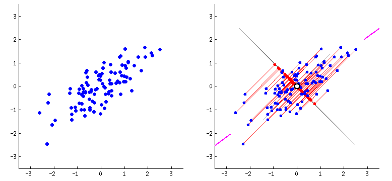

# Unsupervised Metrics

Back to [home](../README.md)

Unsupervised learning is a class of machine learning techniques used to draw inferences from datasets consisting of input data without labeled responses. Unsupervised metrics are essential for understanding the underlying structure and distribution of data, allowing automated data analysis.

## Introduction to Unsupervised Metrics

Unsupervised metrics provide mechanisms to assess models without defined labels. The primary goal is to capture intrinsic relationships in data, enabling tasks like clustering, dimensionality reduction, and anomaly detection. Unlike supervised metrics, unsupervised metrics lack clear performance indicators, such as accuracy, because they operate without ground-truth labels.

## Principal Component Analysis (PCA)

Principal Component Analysis (PCA) is a statistical technique that transforms data into a new coordinate system. It reduces dimensionality by projecting the data onto the directions that maximize variance, called principal components. PCA helps highlight differences in data points that contribute most significantly to variance, thus simplifying data visualization and enhancing pattern recognition.



### Key Steps in PCA:

1. **Standardize the Data**: Ensure each feature has a mean of zero and unit variance.
2. **Compute Covariance Matrix**: Measure how features vary from the mean with respect to each other.
3. **Eigen Decomposition**: Find eigenvectors (principal components) and eigenvalues (variance explained).
4. **Select Components**: Retain those components explaining a significant amount of variance.
5. **Transform Data**: Project data onto selected principal components.

## K-Means Clustering

K-means clustering partitions a dataset into `k` clusters by minimizing the variance within each cluster. It iteratively assigns data points to the closest centroid and recalculates centroids based on current assignments until convergence.


### Python Code: Clustering a Single Vector

```python
import numpy as np

def k_means_vector(vector, k, max_iter=100):
    centroids = np.random.choice(vector, k)
    for _ in range(max_iter):
        clusters = {i: [] for i in range(k)}
        for point in vector:
            distances = np.linalg.norm(point - centroids)
            cluster = np.argmin(distances)
            clusters[cluster].append(point)
        prev_centroids = centroids.copy()
        for i in range(k):
            centroids[i] = np.mean(clusters[i]) if clusters[i] else centroids[i]
        if np.array_equal(prev_centroids, centroids):
            break
    return clusters

vector = np.array([1.0, 2.5, 7.8, 6.3, 9.0])
clusters = k_means_vector(vector, k=2)
print(clusters)
```

### Python Code: Clustering a Matrix

```python
def k_means_matrix(matrix, k, max_iter=100):
    m, n = matrix.shape
    centroids = matrix[np.random.choice(m, k, replace=False)]
    for _ in range(max_iter):
        distances = np.linalg.norm(matrix[:, np.newaxis] - centroids, axis=2)
        labels = np.argmin(distances, axis=1)
        new_centroids = np.array([matrix[labels == j].mean(axis=0) if np.any(labels == j) else centroids[j] for j in range(k)])
        if np.all(centroids == new_centroids):
            break
        centroids = new_centroids
    return labels

data_matrix = np.array([[1.0, 2.0], [2.5, 4.5], [5.0, 6.0], [8.0, 9.0]])
cluster_labels = k_means_matrix(data_matrix, 2)
print(cluster_labels)
```

## Variational Autoencoder (VAE)

Variational Autoencoders are generative models that learn a latent space representation of data. They utilize an encoder-decoder architecture, mapping inputs to a probabilistic latent space and regenerating outputs.

### TensorFlow Implementation using Functional API

```python
import tensorflow as tf
from tensorflow.keras.layers import Input, Dense, Lambda
from tensorflow.keras.models import Model
from tensorflow.keras.losses import mse
import numpy as np

input_dim = 28 * 28
latent_dim = 2

# Encoder
inputs = Input(shape=(input_dim,))
h = Dense(256, activation='relu')(inputs)
z_mean = Dense(latent_dim)(h)
z_log_var = Dense(latent_dim)(h)

def sampling(args):
    z_mean, z_log_var = args
    epsilon = tf.keras.backend.random_normal(shape=(tf.keras.backend.shape(z_mean)[0], latent_dim), mean=0., stddev=0.1)
    return z_mean + tf.exp(0.5 * z_log_var) * epsilon

z = Lambda(sampling)([z_mean, z_log_var])

# Decoder
decoder_h = Dense(256, activation='relu')
decoder_mean = Dense(input_dim, activation='sigmoid')

h_decoded = decoder_h(z)
x_decoded_mean = decoder_mean(h_decoded)

vae = Model(inputs, x_decoded_mean)

# Loss
reconstruction_loss = mse(inputs, x_decoded_mean) * input_dim
kl_loss = -0.5 * tf.keras.backend.sum(1 + z_log_var - tf.square(z_mean) - tf.exp(z_log_var), axis=-1)
vae_loss = tf.keras.backend.mean(reconstruction_loss + kl_loss)

vae.add_loss(vae_loss)
vae.compile(optimizer='adam')
```

## Evaluation of Clustering Methods

Evaluating clustering methods requires metrics that do not rely on true labels. Popular techniques include:

- **Silhouette Score**: Measures cohesion and separation based on mean intra-cluster distance and mean nearest-cluster distance.

$$s(i) = \frac{b(i) - a(i)}{\max(a(i), b(i))}$$

- **Davies-Bouldin Index**: Evaluates the average similarity ratio of each cluster with others, with lower values indicating better clustering.

- **Elbow Method**: Plots explained variance against the number of clusters to find an optimal balance between simplicity and accuracy.

## Practical Applications of Unsupervised Metrics

Unsupervised metrics have diverse applications across numerous domains:

- **Market Segmentation**: Identifying distinct consumer groups based on purchasing behaviors.
- **Data Compression**: Dimensionality reduction methods like PCA for reducing storage needs while maintaining information fidelity.
- **Genomic Data Analysis**: Clustering similar genetic sequences to discern mutations or evolutionary patterns.
- **Anomaly Detection**: Recognizing deviations from standard operation, pivotal in fraud detection and maintenance prediction.
- **Document Clustering**: Grouping similar documents together in content management systems to enhance information retrieval.

In conclusion, unsupervised metrics open avenues for insightful data exploration, enabling discovery and understanding without explicit supervision. As methodologies advance, their applicability will continue to broaden, impacting numerous fields.