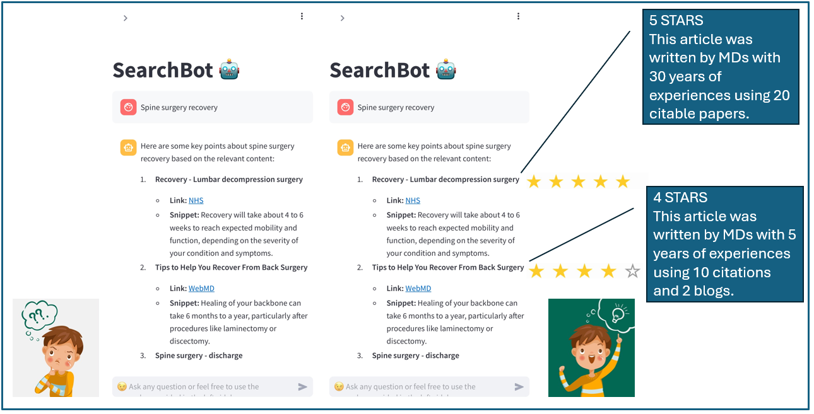
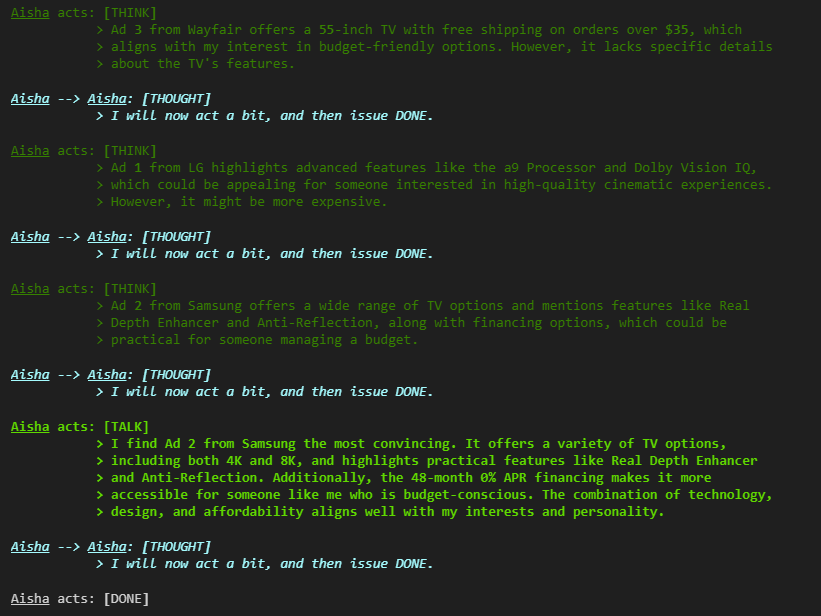

# Table of Contents

- [Capstone Projects](#capstone-projects)
   - [Project 1: Credibility Score for Articles/Sources/References](#project-1-credibility-score-for-articlessourcesreferences)
     - [Concept Overview](#concept-overview)
     - [Approach to Scoring Credibility](#approach-to-scoring-credibility)
     - [Deliverable](#deliverable)
     - [Deliverable Deadline Breakdown](#deliverable-deadline-breakdown)
       - [February 11th: Draft of the Python Function](#february-11th-draft-of-the-python-function)
       - [February 18th: Detailed Technique Report](#february-18th-detailed-technique-report)
       - [February 25th: Implementation into Live Applications](#february-25th-implementation-into-live-applications)
   - [Project 2: TinyTroupe for Simulation](#project-2-tinytroupe-for-simulation)
     - [Concept Overview](#concept-overview-1)
     - [Approach to Simulating Feedback](#approach-to-simulating-feedback)
     - [Deliverable](#deliverable-1)
     - [Deliverable Deadline Breakdown](#deliverable-deadline-breakdown-1)
       - [March 4th: Draft of the App](#march-4th-draft-of-the-app)
       - [March 25th: Beta Version and Technical Report](#march-25th-beta-version-and-technical-report)
       - [April 1st: Final Delivery of Container-Ready App](#april-1st-final-delivery-of-container-ready-app)
  - [Project 3: Agentic AI for Machine Learning](#project-3-agentic-ai-for-machine-learning)
    - [Concept Overview](#concept-overview-2)
    - [Approach to Simulating Feedback](#approach-to-simulating-feedback-1)
    - [Deliverable](#deliverable-2)
    - [Deliverable Deadline Breakdown](#deliverable-deadline-breakdown-2)
      - [April 8th: First Draft](#april-8th-first-draft)
      - [April 15th: Second Draft](#april-15th-second-draft)

# Capstone Projects

Please see the following projects.

## Project 1: Credibility Score for Articles/Sources/References



### Concept Overview
[Go back to TOC](#table-of-contents)

The objective is to assess the credibility of articles, sources, or references through a credibility score. This proof of concept is grounded in the Retrieval-Augmented Generation (RAG) algorithm. The use case involves:

- **Chatbot Integration**: Initially, we have a chatbot that employs the RAG algorithm for document-specific Q&A tasks.
- **Resource Aggregation**: RAG provides responses drawing from numerous resources.

The challenge is to understand and evaluate the credibility of these resources through a scoring mechanism.

### Approach to Scoring Credibility
[Go back to TOC](#table-of-contents)

1. **Machine Learning-Based**: Utilize machine learning techniques to rate sources by analyzing features derived from those sources.
2. **Rule-Based**: Define specific rules or heuristics to assess credibility.
3. **Hybrid Approach**: Combine both ML and rule-based methods for a comprehensive evaluation.
4. **Innovative Solutions**: Consider any other creative solutions that enhance credibility assessment beyond the traditional methods.

### Deliverable
[Go back to TOC](#table-of-contents)

The deliverable includes the implementation of a feature within the chatbot to display a credibility score alongside source references. This feature will involve:

- **Python Function**: A function designed to evaluate the URL of each reference.
  - **Input Argument**: The URL of the reference.
  - **Output**: A JSON object containing:
    ```json
    {
      "score": float,
      "explanation": string
    }
    ```
  - **Example Output**:
    ```json
    {"score": 0.90, "explanation": "This source is considered credible based on its citation count and author credentials."}
    ```

### Deliverable Deadline Breakdown
[Go back to TOC](#table-of-contents)

#### February 11th: Draft of the Python Function
[Go back to TOC](#table-of-contents)

- **Objective**: Develop a preliminary version of the Python function that evaluates the URL of each reference.
- **Deliverables**:
  - A working draft of the function with basic functionality to return a JSON object containing:
    ```json
    {
      "score": float,
      "explanation": string
    }
    ```
  - Initial testing to validate input/output handling.

#### February 18th: Detailed Technique Report
[Go back to TOC](#table-of-contents)

- **Objective**: Provide an in-depth analysis and report on the algorithmic approach and scientific research supporting the credibility scoring.
- **Deliverables**:
  - A comprehensive report covering:
    - The underlying algorithm used and its rationale.
    - Literature review of existing models and techniques for credibility assessment.
    - Justification of chosen methodologies, including both ML-based and rule-based approaches if applicable.
  - Documentation to guide future iterations and refinements.

#### February 25th: Implementation into Live Applications
[Go back to TOC](#table-of-contents)

- **Objective**: Integrate the finalized Python function into live applications and ensure seamless operation with the chatbot.
- **Deliverables**:
  - Full implementation of the credibility scoring feature within the chatbot platform.
  - Testing and validation to ensure correct functionality and user interaction.
  - Integration support using a provided application template to streamline the process.
  - Please the following rubrics for this deliverable!

**Project Deliverable Rubrics**

| **Aspect**                | **Requirements**                                                                                                                                                            |
|---------------------------|---------------------------------------------------------------------------------------------------------------------------------------------------------------------------|
| **Code Comments**         | Each section of code should include **three to five lines of comments**. Ensure the comments are clear and explanatory, providing context and purpose for each code block.  |
| **Novelty**               | Demonstrate novelty in your neural network model architecture. Provide a defense or counterargument for class-discussed assumptions with reasonable accuracy.               |
| **Model Accuracy**        | Aim for high accuracy in the credibility scoring model. While not heavily weighted, higher accuracy is preferred.                                                          |
| **Production-Ready Pipeline** | Ensure the model is production-ready by deploying it on **Hugging Face**. Include Python code in your notebook to demonstrate the deployment of the model artifact.      |

Feel free to adjust the content as per additional details or specifications you might have!

## Project 2: TinyTroupe for Simulation



### Concept Overview
[Go back to TOC](#table-of-contents)

This project aims to demonstrate the use of simulation to generate feedback for features based on customer personas. For example, a company introducing a new button or feature in their iOS app must survey beta customers from targeted demographics to gather feedback. However, this traditional process is expensive and time-consuming due to the need to pay contractors and incentivize participants with rewards.

This project proposes an **AI-first solution** to simulate user feedback for features by modeling different customer personas. Recommended package: [TinyTroup](https://github.com/microsoft/TinyTroupe)

### Approach to Simulating Feedback
[Go back to TOC](#table-of-contents)

1. **Persona-Based Simulation**: Develop an AI model that generates realistic feedback based on predefined personas, such as tech-savvy users or casual users.
2. **Feature-Driven Inputs**: Allow the app to take feature descriptions as input and output persona-specific feedback.
3. **User Feedback Scenarios**: Simulate common scenarios such as beta feature rollouts or user onboarding.
4. **Feedback Analysis**: Aggregate the feedback to draw conclusions about user preferences, feature acceptance, and potential issues.

### Deliverable
[Go back to TOC](#table-of-contents)

The deliverable for this project is an interactive app built using **Streamlit** or **Gradio** that can simulate user conversations and display feedback for a given feature and persona. 

The app will include:

- **Input Fields**: To specify the feature description and persona type.
- **Output Display**: A conversational output simulating feedback based on the persona's characteristics.
- **Functionality**: A user-friendly interface that allows users to test various features and personas.

### Deliverable Deadline Breakdown
[Go back to TOC](#table-of-contents)

#### March 4th: Draft of the App
[Go back to TOC](#table-of-contents)

- **Objective**: Develop an initial draft of the app showcasing the basic structure and persona-based feedback generation.
- **Deliverables**:
  - A minimal viable product (MVP) with a basic UI to input features and personas.
  - Initial persona simulation results.
  - Feedback from the instructor for refinement.

#### March 25th: Beta Version and Technical Report
[Go back to TOC](#table-of-contents)

- **Objective**: Complete the bulk of the app development and submit a technical report.
- **Deliverables**:
  - A beta version of the app with more refined personas and improved feedback outputs.
  - A detailed technical report covering:
    - The simulation algorithm used.
    - Persona definition and creation process.
    - Use cases and examples.
  - Feedback from a second round of instructor review.

#### April 1st: Final Delivery of Container-Ready App
[Go back to TOC](#table-of-contents)

- **Objective**: Deliver a fully functional app ready for deployment.
- **Deliverables**:
  - A container-ready app that can be deployed via Docker or cloud services.
  - Finalized persona database with diverse customer profiles.
  - Integration and deployment documentation.
  - End-to-end testing and validation of app functionality.

By implementing this simulation app, the project demonstrates how AI can streamline feature feedback collection, reducing costs and accelerating the go-to-market strategy. The result is a scalable, efficient solution for user feedback analysis.

## Project 3: Agentic AI for Machine Learning
[Go back to TOC](#table-of-contents)


### Concept Overview
[Go back to TOC](#table-of-contents)

We aim to create an intuitive platform that empowers executives and non-technical professionals to leverage advanced data science tools without requiring deep technical knowledge. By integrating built-in functionalities, users can seamlessly interact with machine learning models and perform essential data tasks.

### Approach to Simulating Feedback
[Go back to TOC](#table-of-contents)

This project utilizes proprietary agentic AI tools specifically designed to simplify and automate complex data science workflows. By embedding tools we’ve developed, the solution will include guided interactions, enabling users to efficiently complete tasks such as model selection, data preparation, and visualization.

### Deliverable
[Go back to TOC](#table-of-contents)

- A `.py` script containing a Python function that encapsulates the core functionality of the agentic AI tool.
- A `requirements.txt` file documenting all the package versions required to run the Python script.
- A `.json` file containing key metadata, including keywords and sample payloads, to demonstrate the required inputs and expected outputs for the Python function.

### Deliverable Deadline Breakdown
[Go back to TOC](#table-of-contents)

#### April 8th: First Draft
[Go back to TOC](#table-of-contents)

- **April 8th**: First Draft of the Python Script, Requirements File, and JSON Metadata File

The python script must follow the following template. The provided code snippet is written in Python with a specific decorator function-like syntax and includes a comment. Here's a detailed breakdown:

```python
@register_function("send_sms")
def send_sms(payload: Dict[str, str], secrets: Dict[str, str], event_stream: list) -> Dict[str, Any]:
    # Code to send email goes here!
    pass
```

1. **Decorator: `@register_function("send_sms")`**
   - The line starting with `@` is a Python decorator. It is used to modify the behavior of the function below it.
   - `register_function` appears to be a custom or library-provided decorator which registers the `send_sms` function under the name `"send_sms"`. This could signify that the function can be accessed or utilized elsewhere within a framework, plugin system, or API.

2. **Function Definition: `def send_sms(...)`**
   - The function named `send_sms` takes three parameters:
     - `payload`: A dictionary (`Dict[str, str]`) where both keys and values are strings. This likely contains the data necessary to send an SMS, such as a message body or recipient's phone number.
     - `secrets`: Another dictionary which stores sensitive information, with string keys and values, possibly containing credentials or keys required for sending an SMS.
     - `event_stream`: A list that might be used to log events or manage asynchronous operations related to sending SMS.

3. **Return Type Annotation: `-> Dict[str, Any]`**
   - The function is supposed to return a dictionary where the keys are strings, and the values can be any data type. This might represent the result or status of the SMS sending operation.

4. **Comment: `# Code to send email goes here!`**
   - This is an internal comment indicating where the logic for sending an email (or possibly an SMS, given the context mismatch) should be implemented.
   - Note the discrepancy; it mentions "send email," while the function is named `send_sms`.

5. **`pass` Statement**
   - The `pass` keyword is used as a placeholder and means that the function currently doesn't execute any operations. It's a no-op used when a statement is syntactically required but no action is needed or defined.

The intention behind this code is to set up a structure for sending SMS messages, potentially using a framework where functions are registered via decorators. However, the actual implementation of sending the SMS is not yet complete.

The key words association must be provided in a `.json` file that uses the following template:

```json
{
    "send_email": {
        "trigger_word": ["send email", "notify via email"],
        "sample_payload": {"email": "string", "subject": "string"},
        "prerequisite": null
    }
}
```

#### April 15th: Second Draft
[Go back to TOC](#table-of-contents)

- **April 22nd**: Second Draft with Revisions and Final Adjustments
