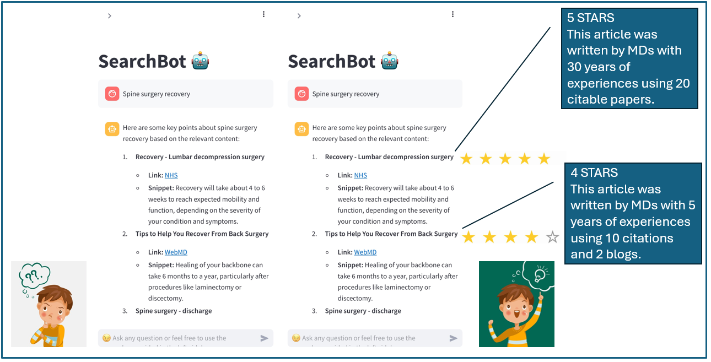
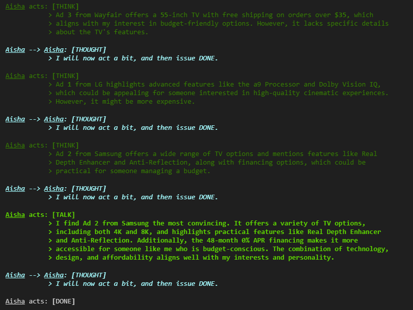

## Table of Contents

- [Capstone Projects](#capstone-projects)
   - [Schedule — Fall 2026](#schedule--fall-2026)
   - [Project 1: Credibility Score for Articles/Sources/References](#project-1-credibility-score-for-articlessourcesreferences)
     - [Concept Overview](#concept-overview)
     - [Approach to Scoring Credibility](#approach-to-scoring-credibility)
     - [Starter Code, Setup, and Grading](#starter-code-setup-and-grading)
     - [Deliverable](#deliverable)
     - [Deliverable Deadline Breakdown](#deliverable-deadline-breakdown)
       - [Deliverable 1: Draft of the Python Function (Sept 25, 2026)](#deliverable-1-draft-of-the-python-function-sept-25-2026)
       - [Deliverable 2: Detailed Technique Report (Oct 2, 2026)](#deliverable-2-detailed-technique-report-oct-2-2026)
       - [Deliverable 3: Implementation into Live Applications (Oct 9, 2026)](#deliverable-3-implementation-into-live-applications-oct-9-2026)
   - [Project 2: PersonaForge — Build an Agent-to-Agent Package](#project-2-personaforge--build-an-agent-to-agent-package)
     - [Concept Overview](#concept-overview-1)
     - [Approach to Building the Package](#approach-to-building-the-package)
     - [Starter Code, Setup, and Grading](#starter-code-setup-and-grading-1)
     - [Deliverable](#deliverable-1)
     - [Deliverable Deadline Breakdown](#deliverable-deadline-breakdown-1)
       - [Deliverable 1: Working Package (Oct 16, 2026)](#deliverable-1-working-package-oct-16-2026)
       - [Deliverable 2: Beta Version and Technical Report (Oct 23, 2026)](#deliverable-2-beta-version-and-technical-report-oct-23-2026)
       - [Deliverable 3: Final Delivery of Container-Ready App (Oct 30, 2026)](#deliverable-3-final-delivery-of-container-ready-app-oct-30-2026)
  - [Project 3: Your Own AI/ML Project](#project-3-your-own-aiml-project)
    - [Concept Overview](#concept-overview-2)
    - [Approach](#approach)
    - [Submission Process](#submission-process)
    - [Deliverable](#deliverable-2)
    - [Deliverable Deadline Breakdown](#deliverable-deadline-breakdown-2)
      - [Deliverable 1: Project Proposal and Initial Work (Nov 6, 2026)](#deliverable-1-project-proposal-and-initial-work-nov-6-2026)
      - [Deliverable 2: Final Project Submission (Nov 13, 2026)](#deliverable-2-final-project-submission-nov-13-2026)

## Capstone Projects

Please see the following projects.

### Schedule — Fall 2026
[Go back to TOC](#table-of-contents)

Every deliverable is due on a **Friday**, one per week, starting the last Friday of
September. Submit through the course form; the latest submission before the deadline
is the one that gets read.

| Week | Due (Friday) | Project | Deliverable |
| --- | --- | --- | --- |
| 1 | **Sept 25, 2026** | Project 1 | Draft of the Python function |
| 2 | **Oct 2, 2026** | Project 1 | Detailed technique report |
| 3 | **Oct 9, 2026** | Project 1 | Implementation into the live app |
| 4 | **Oct 16, 2026** | Project 2 | Working package |
| 5 | **Oct 23, 2026** | Project 2 | Beta version and technical report |
| 6 | **Oct 30, 2026** | Project 2 | Final container-ready app |
| 7 | **Nov 6, 2026** | Project 3 | Project proposal and initial work |
| 8 | **Nov 13, 2026** | Project 3 | Final project submission |

Nothing stops you working ahead — the starter kits for Projects 1 and 2 are in the
repository now, and Project 3 is yours to scope from the start.

## Project 1: Credibility Score for Articles/Sources/References



### Concept Overview
[Go back to TOC](#table-of-contents)

The objective is to assess the credibility of articles, sources, or references through a credibility score. This proof of concept is grounded in the Retrieval-Augmented Generation (RAG) algorithm, which has become increasingly important in modern AI applications for providing accurate, source-backed responses. In today's information-rich environment, users are often overwhelmed by the sheer volume of available sources, making it difficult to distinguish between reliable and unreliable information. This project addresses this critical need by developing an automated system that can evaluate source credibility in real-time.

The use case involves:

- **Chatbot Integration**: Initially, we have a chatbot that employs the RAG algorithm for document-specific Q&A tasks. This chatbot serves as the primary interface where users interact with multiple information sources simultaneously. The integration ensures that users not only receive answers but also understand the reliability of the sources providing those answers.
- **Resource Aggregation**: RAG provides responses drawing from numerous resources across different domains, publications, and databases. These resources can vary significantly in their credibility, ranging from peer-reviewed academic papers to informal blog posts, making credibility assessment essential for maintaining response quality.

The challenge is to understand and evaluate the credibility of these resources through a scoring mechanism. This involves developing sophisticated algorithms that can analyze multiple factors such as source authority, publication quality, citation patterns, and content accuracy to generate meaningful credibility scores that users can trust and understand.

### Approach to Scoring Credibility
[Go back to TOC](#table-of-contents)

1. **Machine Learning-Based**: Utilize machine learning techniques to rate sources by analyzing features derived from those sources. This approach involves training models on large datasets of pre-labeled credible and non-credible sources, enabling the system to learn patterns and characteristics that indicate reliability. Features may include author credentials, publication metrics, citation counts, domain authority, content quality indicators, and temporal relevance. The ML approach offers the advantage of adaptability and can improve over time as more data becomes available.

2. **Rule-Based**: Define specific rules or heuristics to assess credibility based on established journalism and academic standards. These rules might include checking for proper citation practices, verifying author expertise in the subject matter, evaluating the reputation of publishing platforms, and assessing the presence of fact-checking processes. Rule-based systems provide transparency and interpretability, allowing users to understand exactly why a source received a particular credibility score. This approach is particularly valuable for domains with well-established credibility criteria.

3. **Hybrid Approach**: Combine both ML and rule-based methods for a comprehensive evaluation that leverages the strengths of both methodologies. The hybrid system can use rule-based components to establish baseline credibility assessments and handle edge cases, while ML components can identify subtle patterns and relationships that might be missed by predefined rules. This approach often provides the most robust and accurate credibility assessments by balancing interpretability with predictive power.

4. **Innovative Solutions**: Consider any other creative solutions that enhance credibility assessment beyond the traditional methods. This might include real-time fact-checking against multiple databases, sentiment analysis to detect bias, network analysis to understand source relationships and potential conflicts of interest, or blockchain-based verification systems. Innovative approaches could also involve crowd-sourcing credibility assessments, integrating social media sentiment, or using natural language processing to detect misleading language patterns.

### Starter Code, Setup, and Grading
[Go back to TOC](#table-of-contents)

**You do not start this project from an empty folder.** A working chatbot is provided
in [`deliverable/project_1`](https://github.com/yiqiao-yin/pace-u-cs676/tree/main/deliverable/project_1) — clone the
course repository and run it locally on macOS or Windows following the step-by-step
instructions in that folder's
[README](https://github.com/yiqiao-yin/pace-u-cs676/blob/main/deliverable/project_1/README.md).

The starter kit contains:

- `main.py` — a Streamlit chat app calling Claude with web search, which already displays a colour-coded credibility chip beside every source it cites.
- `credibility.py` — **the file you improve.** It holds a deliberately weak baseline implementation of `score_url()`, followed by a numbered list of twelve documented defects in that baseline. Each one is an invitation.
- `evaluate.py` — a harness that scores 24 labelled URLs and reports mean absolute error, band accuracy, and worst-case error. The provided baseline scores **MAE 0.142 / 66.7% band accuracy**. Beating that measurably is the point of the assignment.
- `test_credibility.py` — contract tests for the required input/output shape.

The rule-based scorer, the tests, and the evaluation harness all run **without an API
key**, so you can begin immediately and only spend credits once you reach the chat
interface.

**Weighting: this project is 30% of your course grade, marked out of 100 points**
(deliverable 1: 25, deliverable 2: 35, deliverable 3: 40). An additional **5% bonus**
is added to your course grade for deploying a working app to Hugging Face Spaces. The
detailed point-by-point rubric is in the project README, and the full course weighting
and letter-grade scale are in the [course
README](https://github.com/yiqiao-yin/pace-u-cs676#grading-policy).

### Deliverable
[Go back to TOC](#table-of-contents)

The deliverable includes the implementation of a feature within the chatbot to display a credibility score alongside source references. This feature represents a significant enhancement to the user experience by providing immediate, actionable information about source reliability. The implementation must be seamless, efficient, and user-friendly, ensuring that credibility information enhances rather than clutters the chatbot interface. The scoring system should be calibrated to provide meaningful distinctions between sources while avoiding false precision that might mislead users.

This feature will involve:

- **Python Function**: A function designed to evaluate the URL of each reference through comprehensive analysis of multiple credibility indicators. The function must be robust enough to handle various types of sources (academic papers, news articles, government publications, etc.) while being efficient enough for real-time application. It should implement error handling for cases where sources are inaccessible or insufficient data is available for analysis.
  - **Input Argument**: The URL of the reference, which serves as the primary identifier for the source to be evaluated.
  - **Output**: A JSON object containing structured credibility information that is both machine-readable and easily interpretable:
    ```json
    {
      "score": float,
      "explanation": string
    }
    ```
  - **Example Output**: The output provides a numerical score (typically between 0 and 1) along with a human-readable explanation of the scoring rationale:
    ```json
    {"score": 0.90, "explanation": "This source is considered credible based on its citation count and author credentials."}
    ```

### Deliverable Deadline Breakdown
[Go back to TOC](#table-of-contents)

#### Deliverable 1: Draft of the Python Function (Sept 25, 2026)
[Go back to TOC](#table-of-contents)

- **Objective**: Get the starter kit running, record its baseline, and make your first real improvement to `score_url()`. You are not writing this function from scratch — a working but deliberately weak version is provided, along with twelve documented defects in it. This phase is about understanding exactly what the baseline does before you change it, so that every later change is a deliberate choice you can defend.
- **Deliverables**:
  - A working draft of the function with basic functionality to return a JSON object containing structured credibility information. The function should handle common URL formats, implement basic error handling for invalid inputs, and provide consistent output formatting. At this stage, the scoring mechanism may rely on simple heuristics or basic feature extraction, but it must demonstrate the core functionality:
    ```json
    {
      "score": float,
      "explanation": string
    }
    ```
  - Your recorded baseline from `python evaluate.py` (the provided starter scores **MAE 0.142, band accuracy 66.7%, worst error 0.410**) and at least one measured improvement on it.
  - Testing that validates input and output handling: `python test_credibility.py` must still pass, and you must add your own cases for URL types and malformed inputs the provided 21 tests do not already cover.

#### Deliverable 2: Detailed Technique Report (Oct 2, 2026)
[Go back to TOC](#table-of-contents)

- **Objective**: Provide an in-depth analysis and report on the algorithmic approach and scientific research supporting the credibility scoring. This deliverable focuses on the theoretical foundation and empirical justification for the chosen methodology, ensuring that the credibility assessment system is grounded in established research and best practices. The report should demonstrate a thorough understanding of the credibility assessment domain and provide a roadmap for algorithmic improvements.
- **Deliverables**:
  - A comprehensive report covering multiple critical aspects of the credibility assessment system. The report should be written at a technical level appropriate for peer review and should include experimental validation of the chosen approach:
    - The underlying algorithm used and its rationale, including detailed explanations of feature selection, scoring mechanisms, and decision thresholds. This section should provide sufficient detail for reproduction and include discussions of algorithm complexity and scalability considerations.
    - Literature review of existing models and techniques for credibility assessment, covering both academic research and industry implementations. The review should identify gaps in current approaches and explain how the proposed solution addresses these limitations.
    - Justification of chosen methodologies, including both ML-based and rule-based approaches if applicable, with empirical evidence supporting the selection criteria. This should include comparative analysis of different approaches and discussion of trade-offs between accuracy, interpretability, and computational efficiency.
  - Documentation to guide future iterations and refinements, including detailed API specifications, algorithm parameters that may need tuning, and identified areas for improvement. The documentation should also include guidelines for maintaining and updating the credibility assessment model as new research becomes available.

#### Deliverable 3: Implementation into Live Applications (Oct 9, 2026)
[Go back to TOC](#table-of-contents)

- **Objective**: Make the scoring feature work well inside the running application. The wiring is already done — the app extracts citations and renders a colour-coded chip beside each source — so this deliverable is about the quality and reliability of what those chips say, not about building the integration from nothing.
- **Deliverables**:
  - Full implementation of the credibility scoring feature within the chatbot platform, including user interface components that display credibility scores in an intuitive and non-intrusive manner. The implementation should handle concurrent requests efficiently and provide fallback mechanisms for cases where credibility assessment fails or takes too long to complete.
  - Testing and validation to ensure correct functionality and user interaction across different scenarios, including unit tests for individual components, integration tests for the complete system, and user acceptance testing to validate the interface design. The testing should cover edge cases, error conditions, and performance under load.
  - Clean separation maintained between the scoring logic in `credibility.py` and the application in `main.py`. Someone should be able to import your scorer into a different app without dragging Streamlit along with it.
  - Please follow the following rubrics for this deliverable!

**Project Deliverable Rubrics**

| **Aspect**                | **Requirements**                                                                                                                                                            |
|---------------------------|---------------------------------------------------------------------------------------------------------------------------------------------------------------------------|
| **Code Comments**         | Each section of code should include **three to five lines of comments**. Ensure the comments are clear and explanatory, providing context and purpose for each code block.  |
| **Novelty**               | Show something beyond a longer lookup table, and defend it. Extending the domain list is the obvious move and earns the fewest points; reading the page, using real publication metadata, or learning the weights from labelled data are not. Disagreeing with a label in `evaluate.py` and arguing your case counts as novelty. |
| **Accuracy**              | Report measured before/after numbers from `python evaluate.py` — mean absolute error, band accuracy, and worst-case error against the baseline of 0.142 / 66.7% / 0.410. A measured improvement matters more than a large one; "it seems better" earns nothing. |
| **Robustness**            | The scorer must not crash the app. Dead links, timeouts, malformed URLs, and API failures all have to degrade to a score and an explanation. `test_credibility.py` must still pass. |
| **Deployment (bonus)**    | Deploying the working app to **Hugging Face Spaces** adds **+5%** to your course grade. This is a bonus, not a requirement — the base 100 points are earned locally.       |

The point-by-point breakdown for each deliverable is in the
[project README](https://github.com/yiqiao-yin/pace-u-cs676/blob/main/deliverable/project_1/README.md#deliverables-and-grading).

## Project 2: PersonaForge — Build an Agent-to-Agent Package



**Weighting: 30% of your course grade, marked out of 100 points, plus a +5% bonus for
deploying a working app to Hugging Face Spaces.** See the [course
README](https://github.com/yiqiao-yin/pace-u-cs676#grading-policy) for the full
weighting and the letter-grade scale.

### Starter Code, Setup, and Grading
[Go back to TOC](#table-of-contents)

**Project 1 asked you to improve a function inside someone else's app. This one asks
you to build a Python package.** A runnable skeleton called **PersonaForge** is
provided in
[`deliverable/project_2`](https://github.com/yiqiao-yin/pace-u-cs676/tree/main/deliverable/project_2)
— clone the course repository and follow the macOS and Windows instructions in that
folder's
[README](https://github.com/yiqiao-yin/pace-u-cs676/blob/main/deliverable/project_2/README.md).

What the skeleton does: you talk to an agent in your terminal, ask it to invent
characters, and then tell those characters to talk to each other. The architecture is
one idea repeated — **a persona is a markdown file, an agent is that file plus a model,
and a conversation is agents taking turns.** Personas are written to `temp/` as `.md`
files you can open and edit by hand; change a line and the character behaves
differently on the next run.

It is a proper `uv` project with a `src/` layout, a real package under
`src/personaforge/`, and a `tests/` suite:

- `main.py` — entry point. `uv run main.py`
- `src/personaforge/persona.py` — persona files: generate, save, load, find
- `src/personaforge/agent.py` — markdown plus model becomes a character
- `src/personaforge/conversation.py` — the turn loop
- `src/personaforge/orchestrator.py` — **the weakest part.** It routes what you typed using regular expressions. Replacing that with genuine Claude tool use is the headline task of this project; the tool schemas you need are already sketched in a comment there.
- `tests/` — **39 tests that run offline in under a second**, because every test injects a fake model instead of calling the API

Run `uv run main.py --offline` to drive the entire app with no API key and no cost —
the scripted stub creates personas and runs conversations so you can see the shape of
the system before spending anything. Every module ends with a **YOUR TASK** comment
block listing what is wrong with it; those lists are the assignment.

For background on the Microsoft TinyTroupe library that inspired this project, see
[`tinytroupe_usage_guide.md`](https://github.com/yiqiao-yin/pace-u-cs676/blob/main/deliverable/project_2/tinytroupe_usage_guide.md).
You are not required to use TinyTroupe itself — you are building your own package.

### Concept Overview
[Go back to TOC](#table-of-contents)

Multi-agent systems are the current frontier of applied AI, and the interesting
engineering problem in them is not the model — it is everything around it. How does an
agent know who it is? Where does that identity live? How do two agents share a
conversation without sharing a mind? Who decides which one speaks next?

This project makes you answer those questions by building the machinery yourself. The
approach here is that **a persona is a plain markdown file on disk**. That single
decision has consequences you will feel immediately: personas are inspectable, you can
version them in git, you can hand-edit one in a text editor and watch the character
change on the next run, and an agent is nothing more than one of those files handed to
a model. There is no persona database and no hidden state.

Microsoft's [TinyTroupe](https://github.com/microsoft/TinyTroupe) is the library that
inspired this project and is worth reading for its `TinyPerson` / `TinyWorld`
abstractions. **You are not using it.** You are writing your own package that does the
same job your way, because the point of the assignment is to understand the
abstractions rather than to consume them.

### Approach to Building the Package
[Go back to TOC](#table-of-contents)

1. **Personas as files**: Represent each character as a markdown document with
   frontmatter for the fields your code indexes on (name, role, summary) and a body
   describing background, personality, speech patterns, goals, and limits. The body
   becomes the agent's system prompt verbatim. Decide what happens when two personas
   collide, when a file is malformed, and when the model ignores your requested format.

2. **Agents as file plus model**: An agent is a persona file bound to a model client.
   Nothing else should distinguish one character from another — same class, same model,
   different file. Getting this boundary right is what makes the rest composable.

3. **Conversation as a protocol**: Agents take turns. Each one sees the transcript
   rewritten from its own point of view — its own lines as assistant turns, everyone
   else's as user turns — which is what makes a model behave like a participant instead
   of something narrating a script. Strict round-robin is the starting point, not the
   answer.

4. **An orchestrator that understands intent**: The user types "I want a patient and a
   doctor, and have them argue about the diagnosis." Something must turn that into
   calls into your package. Pattern matching gets you started; tool use is what makes it
   an agent.

5. **Package discipline**: This is a package, not a script. A clean public API, a
   `src/` layout, tests that run without network access, errors that tell the caller
   what to do next, and a README someone else could follow.

### Deliverable
[Go back to TOC](#table-of-contents)

The deliverable is **an installable Python package plus a terminal application that
uses it.** You talk to an orchestrating agent, ask it to create characters, and then
tell those characters to talk to each other while you watch.

A concrete session looks like this:

```
you › create a persona patient with chronic back pain who distrusts doctors
stage › Created Maria Delgado (patient) — 58-year-old with chronic lumbar pain
  · wrote temp/maria-delgado.md

you › create a persona doctor who is direct and running forty minutes late
stage › Created Dr. Samuel Reyes (doctor) — overbooked internist, blunt bedside manner

you › have them talk about the MRI results
── conversation: the mri results ──
Maria Delgado: I've been waiting three weeks for someone to tell me what this means.
Dr. Samuel Reyes: I know, and I'm sorry about that. Let me pull it up now.
```

The application must:

- **Create personas on request** and persist each one as a markdown file you can open and edit. The character's behaviour on the next run must reflect the edit.
- **Run conversations between two or more personas**, printing each line as it arrives rather than dumping the transcript at the end, and saving the result.
- **Accept natural instructions** rather than fixed commands. "Have the doctor and the nurse discuss the schedule" should work without the user learning a syntax.
- **Run its test suite offline.** Tests that require an API key are tests nobody runs.

The medical scenario above is only an example. A teacher and a student, a customer and
a support agent, two historians disagreeing about a date — pick a domain you find
interesting, because you will read a great deal of its output.

### Deliverable Deadline Breakdown
[Go back to TOC](#table-of-contents)

#### Deliverable 1: Working Package (Oct 16, 2026)
[Go back to TOC](#table-of-contents)

- **Objective**: Get the starter kit running, understand its architecture, and make your first substantive extension to it. This phase is about establishing the ground truth of what the skeleton does and does not do, so that everything you build afterwards is a deliberate choice rather than an accident.
- **Deliverables**:
  - The project running on your machine from a clean clone: `uv sync` followed by `uv run main.py`, with `uv run pytest` passing. Include a short note on anything that did not work on your platform, since that is useful to the next student.
  - **At least one substantive extension** beyond the skeleton, clearly identified. Extending the persona template is not substantive; replacing the regex router with tool use, giving agents persistent memory, or changing how turn-taking is decided all are.
  - **Your own tests for what you added**, following the existing pattern of injecting a fake model so the suite stays offline and fast.
  - A saved conversation transcript your system produced, with a paragraph on what the agents got right and where they broke character.

#### Deliverable 2: Beta Version and Technical Report (Oct 23, 2026)
[Go back to TOC](#table-of-contents)

- **Objective**: Turn the extended skeleton into a system with a point of view, and write up the reasoning behind it. The report matters as much as the code — the questions this project raises rarely have one right answer, so the defence of your choice is the substance.
- **Deliverables**:
  - A design write-up covering what you changed and why, with the alternatives you rejected. If you gave agents memory, say where you put it and what you gave up. If you replaced the router with tool use, show the tool schemas and describe what the model does with an ambiguous request.
  - **Transcripts as evidence**, annotated. Include at least one conversation that went well and one that went badly, and explain the difference. A failure you understand is worth more than a success you cannot account for.
  - **An honest failure analysis**: where agents break character, where they lose the thread, where the cost becomes unreasonable. Measure the cost — a six-turn conversation is at least six API calls, and you should know what that actually costs.
  - Test coverage of the parts you own, with an explanation of what your tests do and do not verify.

#### Deliverable 3: Final Delivery of Container-Ready App (Oct 30, 2026)
[Go back to TOC](#table-of-contents)

- **Objective**: Ship a package someone else could pick up and use. This deliverable is about completeness and robustness rather than new features — a smaller system that behaves well beats an ambitious one that falls over.
- **Deliverables**:
  - A finished package with a coherent public API, docstrings explaining intent, comments at the course standard of three to five explanatory lines per section, and no dead code left from experiments.
  - **Robustness**: bad input, a persona that does not exist, a malformed persona file, and an API failure mid-conversation must all be handled. A crashed turn should not lose the transcript.
  - Documentation that lets another developer install, run, test, and extend your package without asking you a question.
  - A live demo during your presentation slot, plus a defence of what is novel in your version.
  - **Optionally, a deployment for the +5% bonus.** This is a terminal app and Hugging Face Spaces serves web pages, so the honest path is a small Gradio or Streamlit front end that calls your package — which is easy if your package boundaries are clean, and revealing if they are not.

The rubric point split is 25 / 35 / 40 across the three deliverables; the point-by-point
breakdown is in the
[project README](https://github.com/yiqiao-yin/pace-u-cs676/blob/main/deliverable/project_2/README.md#deliverables-and-grading).

By building this package rather than importing one, you end up understanding where the
hard parts of multi-agent systems actually live: not in calling a model, but in
deciding what an agent is, what it remembers, and who gets to speak.

## Project 3: Your Own AI/ML Project
[Go back to TOC](#table-of-contents)


**Weighting: 30% of your course grade, marked out of 100 points.** This is a required
take-home project on a topic of your own choosing. No Hugging Face bonus applies here —
the two 5% deployment bonuses are attached to Projects 1 and 2. See the [course
README](https://github.com/yiqiao-yin/pace-u-cs676#grading-policy) for the full
weighting and the letter-grade scale.

### Concept Overview
[Go back to TOC](#table-of-contents)

**This project is required and is worth 30% of your course grade.** Unlike Projects 1 and 2, the topic is yours to choose: this is where you show what you can build without a specification handed to you.

This project is entirely open-ended and allows you to pursue your own interests. You can choose from a wide variety of project types, including but not limited to:

- Building a chatbot or conversational AI system
- Writing a research paper on an AI/ML topic
- Training and deploying machine learning models
- Developing an agentic AI application
- Creating a data analysis or visualization tool
- Implementing a computer vision or NLP application
- Experimenting with LLMs and prompt engineering
- Building an AI-powered web application
- Any other AI/ML-related project of your choice

The key requirement is that your project demonstrates meaningful engagement with AI or machine learning concepts covered in the course.

### Approach
[Go back to TOC](#table-of-contents)

Your approach will depend entirely on the project you choose. Consider the following when planning your project:

1. **Scope Appropriately**: Choose a project you can genuinely finish in the time available. A small system that works end to end beats an ambitious one that does not run.

2. **Leverage Course Concepts**: Try to incorporate concepts, tools, or techniques we've covered in class (RAG, agentic AI, LLMs, machine learning pipelines, etc.).

3. **Focus on Learning**: This is an opportunity to explore something you're genuinely interested in, so prioritize learning and experimentation.

4. **Document Your Work**: Maintain clear documentation of your process, decisions, and results.

### Submission Process
[Go back to TOC](#table-of-contents)

To submit your project, follow these steps:

1. **Create a GitHub Repository**: Host your project code, documentation, and any supporting materials in a GitHub repository.

2. **Include a README**: Your repository should have a comprehensive README.md file that explains:
   - What your project does
   - Why you chose this project
   - Technologies and tools used
   - How to run/reproduce your work
   - Results and conclusions

3. **Submit via wyn360search.com**:
   - Navigate to [wyn360search.com](https://wyn360search.com)
   - Log in to your account
   - Go to the REPO page
   - Click the 'ADD REPOSITORY' button
   - Enter your GitHub repository URL
   - Complete the submission

Once you have added your repository through the website, the instructors will be able to review your work and provide feedback.

### Deliverable
[Go back to TOC](#table-of-contents)

Your deliverable will vary based on your chosen project, but should generally include:

- A GitHub repository containing all project files
- A comprehensive README.md file
- Source code (if applicable)
- Documentation explaining your methodology and results
- Any necessary configuration files (requirements.txt, environment files, etc.)
- Results, outputs, or demonstrations of your work

### Deliverable Deadline Breakdown
[Go back to TOC](#table-of-contents)

#### Deliverable 1: Project Proposal and Initial Work (Nov 6, 2026)
[Go back to TOC](#table-of-contents)

- **Objective**: Define your project scope and begin initial development or research.

- **Deliverables**:
  - A project proposal (can be in your README.md) that outlines:
    - Project title and description
    - Objectives and goals
    - Planned approach and technologies
    - Expected outcomes
  - Initial work demonstrating progress on your project
  - A GitHub repository with your initial commits

#### Deliverable 2: Final Project Submission (Nov 13, 2026)
[Go back to TOC](#table-of-contents)

- **Objective**: Complete your project and submit it for evaluation.

- **Deliverables**:
  - A complete GitHub repository with all project files
  - Comprehensive documentation and README
  - Working code, trained models, or completed research paper (depending on your project type)
  - Submission through the wyn360search.com website as described above
  - A brief reflection on what you learned and any challenges you encountered

**Note**: Submit early enough to get feedback. Work that arrives after the last session cannot be reviewed before grades are due.
